.. _cloud_implementation_part1:

AWS account and container registry (ECR or Docker Hub)
------------------------------------------------------

This section provides step by step guidance on how to create and configure your AWS account and (optionally) create a container registry 
on either AWS ECR or Docker Hub for hosting TOPAS-nBio images. 

.. _aws_account_setup:

1. Create an AWS account
^^^^^^^^^^^^^^^^^^^^^^^^

Before you're able to run TOPAS-nBio jobs on AWS, you need an have an AWS account. You can create an account by following the steps below.

* **1.1 Sign up to AWS**.

   * https://signin.aws.amazon.com/signup?request_type=register
   * Choose an account name.

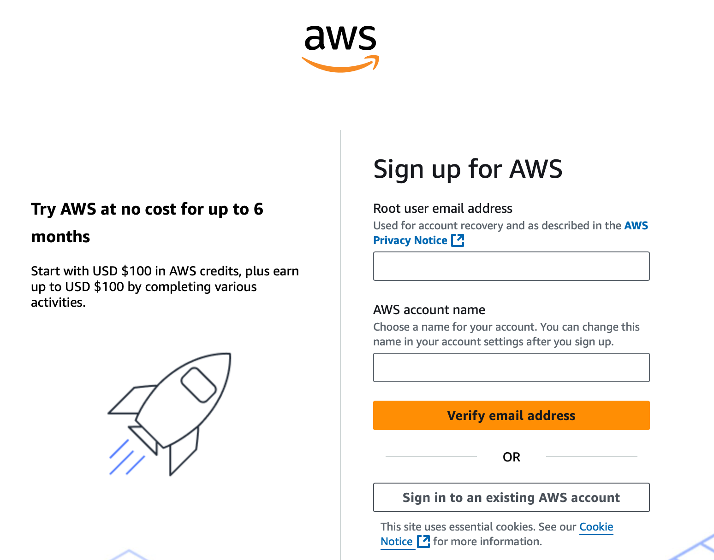

* **1.2 Choose a paid plan**.

   * The free plan has limited capabilities and typically expires after a few months.
   * A paid plan persists indefinitely and is more appropriate for a long-lived account,
     even if your actual usage stays within the free tiers.

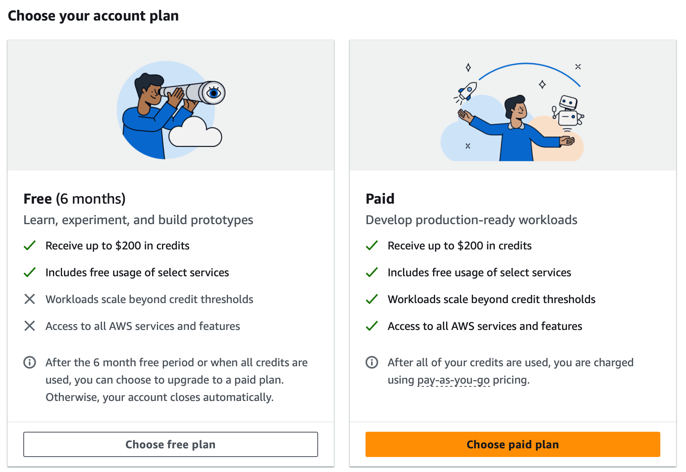

* **1.3 Continue through the sign-up steps until your account is active**.

.. list-table::
   :widths: 25 25 25 25
   :header-rows: 0
   :class: no-row-bg

   * - .. image:: images/part1/3a.png
         :align: center
     - .. image:: images/part1/3b.png
         :align: center
     - .. image:: images/part1/3c.png
         :align: center
     - .. image:: images/part1/3d.png
         :align: center

When you first create an AWS account, you receive a **root** user. AWS recommends that you never use the root user for day-to-day tasks.
Instead, you create one or more **IAM users** and use those for all normal work.

What we will do next is setup multi-factor authentication (MFA) on the root account and then create an IAM account.

* **1.4 Enable MFA on the root account**.

   * In the AWS Console search bar, type **IAM** and click on the **IAM** text to open the IAM dashboard.

    .. figure:: images/part1/4a.png
      :alt: IAM dashboard
      :align: center

   * Under **Security recommendations**, choose **Add MFA** for the root user.

    .. figure:: images/part1/4b.png
      :alt: Add MFA for root user
      :align: center

   * Choose an authentication method (for example, an authenticator app on your phone).

    .. figure:: images/part1/4c.png
      :alt: Choose authentication method
      :align: center

   * If you chose the authenticator app, you will be asked to scan the QR code with the app, enter the code it displays, then wait 30 
     seconds before entering a second code.

    .. figure:: images/part1/4d.png
      :alt: Enter MFA codes
      :align: center

.. _cloud_step1_5_create_iam_user:

* **1.5 Create an IAM admin user**.

   * Type in **IAM** in the search bar, hover over **IAM** then select **Users**.

    .. figure:: images/part1/5a.png
      :alt: IAM users
      :align: center
   
   * In the IAM console choose **Create user**.

    .. figure:: images/part1/5b.png
      :alt: Create user
      :align: center

   * Enter a user name. For simplicity, you could use the username of the root account you created and append **_IAM** to the end of it.
     This makes it clear that this user is for IAM.
   * On the next page ensure **Add user to group** is selected and click on the **Create group** button.

    .. figure:: images/part1/5d.png
      :alt: Create group
      :align: center

   * Name it something like **Admins** then in the permission policies search for **AdministratorAccess** (should be the second option) and click it. Then create the group.
     
    .. figure:: images/part1/5e.png
      :alt: AdministratorAccess policy
      :align: center

   * Once the group is created, be sure to select it so that the user is added to the group. Then click **Next** and then **Create user**.
     
    .. figure:: images/part1/5f.png
      :alt: Add user to group
      :align: center

   * This user we just created has a 12-digit account ID tied to it which you need to use when logging in. In order to avoid having to remember 
     this long number everytime you want to log in, you can create an account alias. In the search bar type **IAM** and click on the **IAM** text to open the IAM dashboard.
     In the IAM dashboard click **Create** account alias, then choose an alias i.e. ``topas-nbio`` and click **Create**.

    .. note::

      After clicking on **IAM** in order to navigate to the IAM dashboard, you might get a message asking you if you really want to leave the page. 
      This is because the user's password was not downloaded. Typically, the root user creates IAM accounts for people under them then sends them the password, 
      but since you created the IAM account for yourself you know the password, so it is fine to leave the page.

    .. figure:: images/part1/5g.pdf
      :alt: Create account alias
      :align: center

* **1.6 Setup billing alerts and free-tier alerts**.

The last thing that needs to be done while still logged in as the root user is to enable billing alerts and free-tier alerts. 

* First search **Billing** and click on **Billing and Cost Management** to open the Billing and Cost Management dashboard.

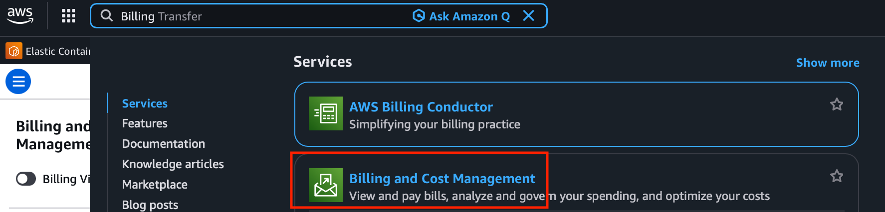

* This should take you to a page where you can see your **Cost summary** and **Cost breakdown** for your account.

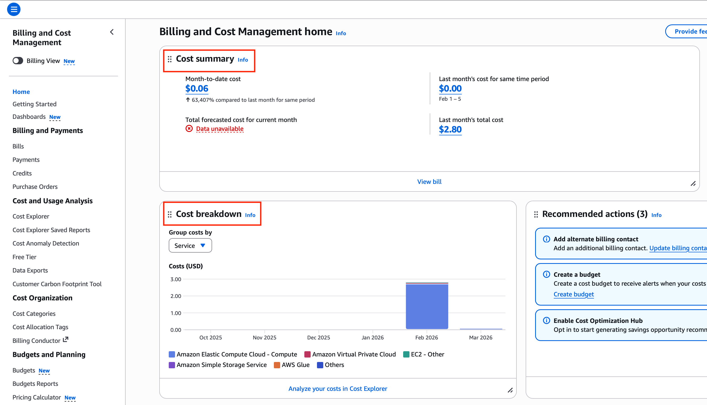

* In order to setup billing alerts and free tier alerts, scroll down on the left sidebar and click on **Billing preferences**.

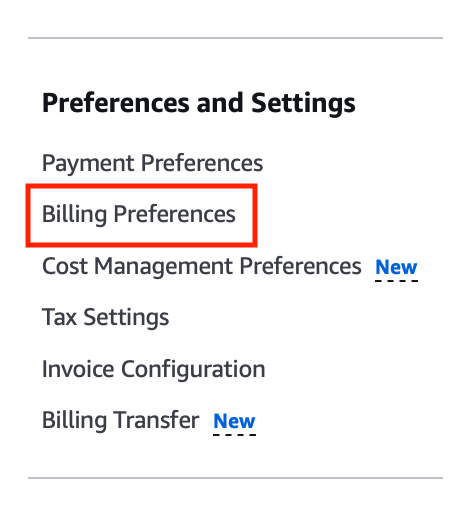

* On the billing preferences page, click on **edit** in the **Alert preferences** section, check both boxes, enter your email address, then click on **Update**.

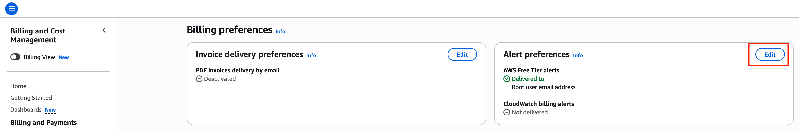

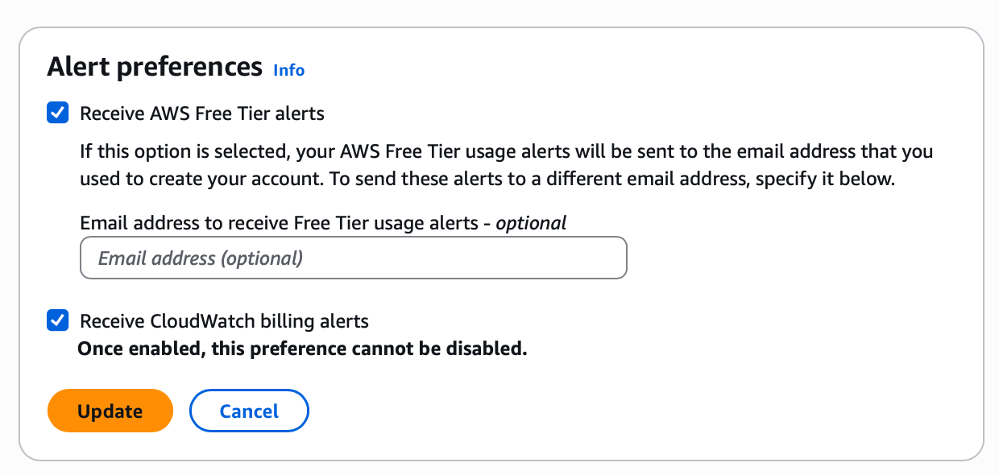

As specified earlier, the following steps (:ref:`2 <cloud_step2_repositories>` and :ref:`3 <cloud_step3_github_actions>`) are only required if you want to host your own customised TOPAS-nBio images on either AWS ECR or Docker Hub. 
**If you are happy to use the official TOPAS-nBio image**, you can skip these steps and move directly from here to :ref:`step 4 <cloud_implementation_part2>`.

.. _cloud_step2_repositories:

2. Create an AWS ECR or Docker Hub repository for TOPAS-nBio
^^^^^^^^^^^^^^^^^^^^^^^^^^^^^^^^^^^^^^^^^^^^^^^^^^^^^^^^^^^^

The following set of steps will guide you through how to setup an AWS ECR public repository for TOPAS-nBio. If you are interested in hosting your own custom TOPAS-nBio 
images on Docker Hub instead, skip to step :ref:`2.3 <cloud_step2_3_docker_hub>`.

* **2.1 Log in to AWS as the IAM user**.

* Log out of the root user, and click **Sign in to console** in the top right corner of the page. By default you will be redirected to the IAM user login page.
  You'll see an option at the bottom to sign in as the root user if you need to check billing details for example. However for all subsequent steps you should 
  use the IAM user you created in step 1.5.
* Fill in the IAM user account ID (or alias) and the password you set for this IAM user.

.. figure:: images/part1/5h.pdf
  :alt: IAM user login page
  :width: 40%
  :align: center

* **2.2 Create an AWS ECR public repository**.

This AWS repository will host your customised TOPAS-nBio docker image, and you will be able to "pull" the image from this repository when 
using cloud computing resources to run your simulations. 

* In the search bar type **ECR**. You're able to star it for easier access in the future. Then click on **Repositories**.

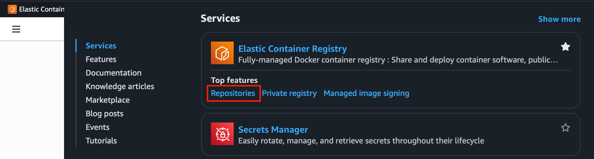

* Open the **Repositories** page under the **Public registry** section, then choose **Create repository**.

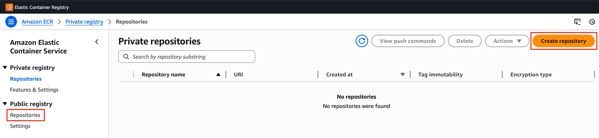

* Fill in the repository details:

   * Name: for example, ``topas-nbio-test`` (lowercase, no spaces).
   * Content type: x86_64 and Linux operating system.
   * About: a short summary of TOPAS-nBio (you may copy this from the TOPAS-nBio README).
   * Usage: for example, a short paragraph explaining that the image provides a containerised TOPAS-nBio build for running Monte Carlo simulations on local
     machines or on cloud/HPC environments.

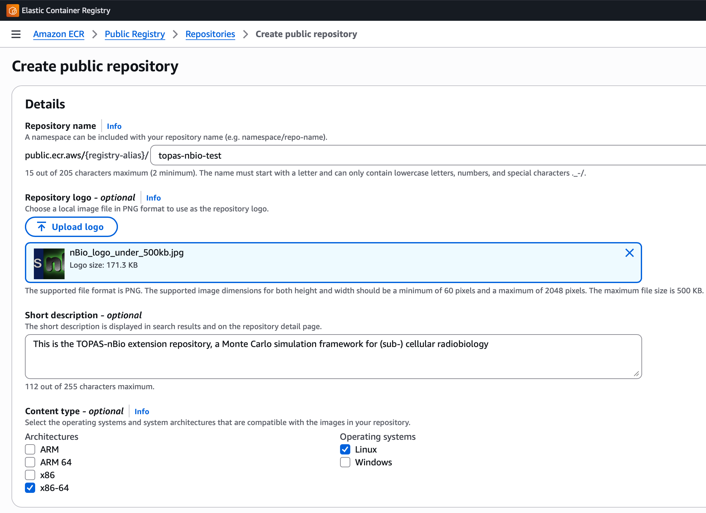

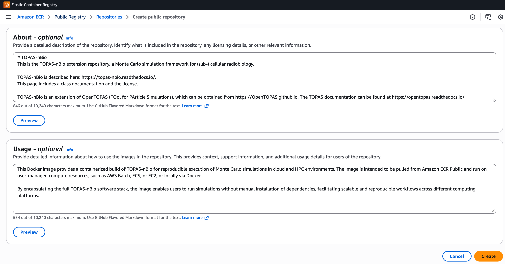

* Once the repository is created, you should see the name of the repository in the list of public repositories. Copy the **repository URI** and your 
  **AWS account ID** and store them somewhere safe; you will need both when configuring GitHub Actions.

.. figure:: images/part1/6e.pdf
  :alt: ECR repository URI and AWS account ID
  :align: center

.. warning::

   If you accidentally create a **private** ECR repository different `pricing`_ applies. For the workflow described in this chapter we 
   recommend using a public ECR repository. Before going further verify that you created a public repository.

.. _cloud_step2_3_docker_hub:

* **2.3 Using Docker Hub instead of ECR**.

If you prefer to host your TOPAS-nBio image on Docker Hub instead of ECR Public, first install Docker Desktop:

* For macOS (https://docs.docker.com/desktop/setup/install/mac-install/)
* For Windows (https://docs.docker.com/desktop/setup/install/windows-install/)
* For Linux (https://docs.docker.com/desktop/setup/install/linux)

* You should be prompted to create a Docker Hub account as part of the installation. If not, create one at https://app.docker.com/signup/ and choose work or personal.
  The following instructions will assume you have created a personal account.

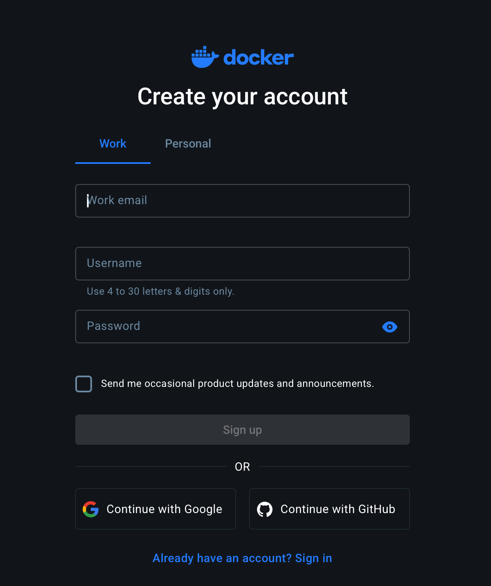

* Once you account is created take note of your account name. To create a personal access token (PAT), go to **Settings → Personal access tokens**.

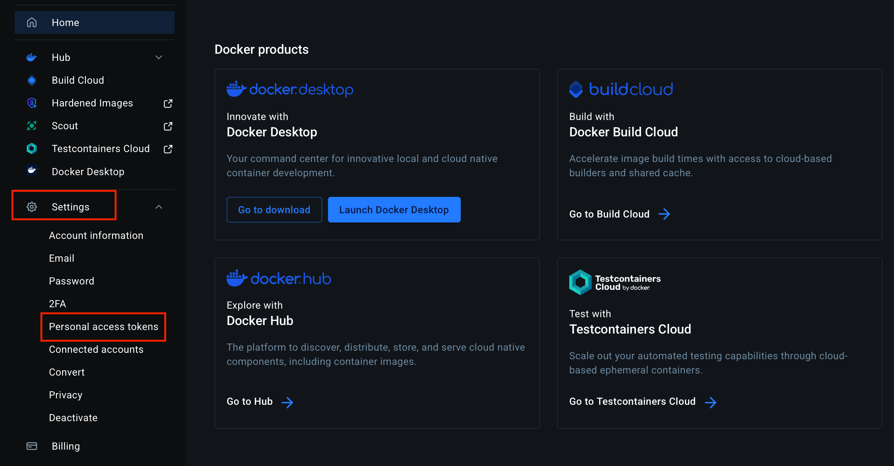

* Choose a name, choose an expiration date, and ensure it has at least read and write permissions. Then click on **Generate**.

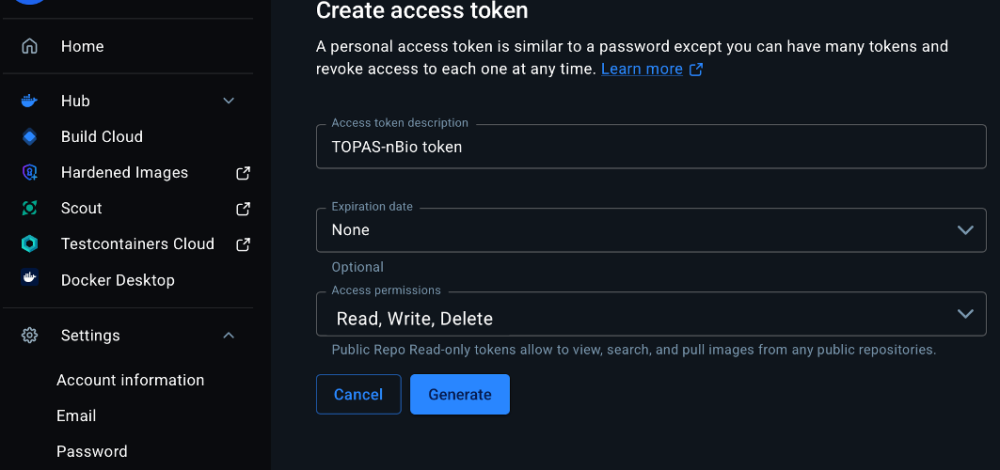

* You should then be redirected to the personal access tokens page. Copy the token and store it securely. This will be needed in step :ref:`3.3 <cloud_step3_3_add_github_repository_secrets>`
  when adding the secrets to your GitHub repository, needed by the GitHub Actions workflow to push the image to Docker Hub.

To create a repository to host your TOPAS-nBio image go to **My Hub → Repositories → Create a repository**.

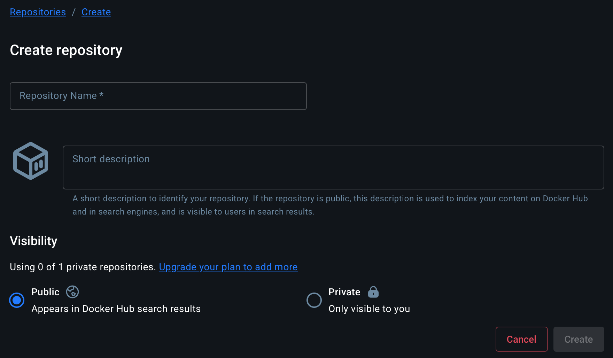

.. _cloud_step3_github_actions:

3. Allow GitHub Actions to push images to ECR
^^^^^^^^^^^^^^^^^^^^^^^^^^^^^^^^^^^^^^^^^^^^^

To build and publish TOPAS-nBio images from your GitHub repository, you can use GitHub Actions. For GitHub Actions to push images into your ECR Public repository 
without long‑lived AWS access keys, you need to configure the following for GitHub Actions:

* An **OIDC identity provider**.
* An **IAM role**.

Effectively these steps allow GitHub actions to authenticate securely with AWS, and prove to AWS that you are the owner of the repository.

* **3.1 Create an OIDC identity provider for GitHub**.

* Type **IAM** in the search bar then click on **Identity providers** then **Add provider**.

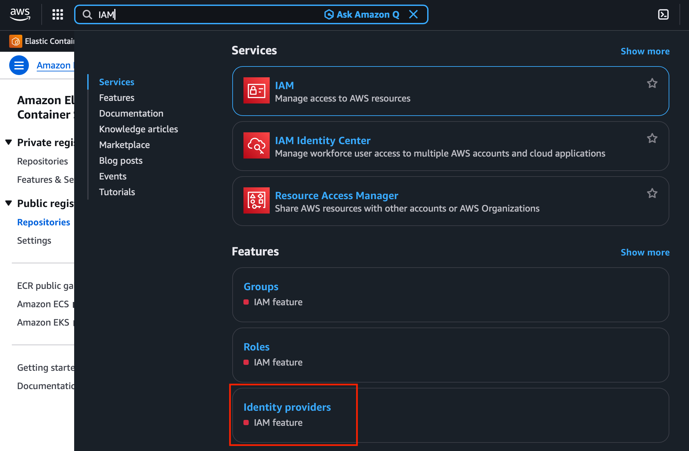

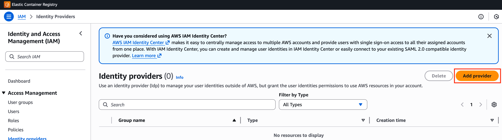

* Select **OpenID Connect**, use the url ``https://token.actions.githubusercontent.com`` and specify the audience as ``sts.amazonaws.com`` before clicking on **Add provider**.

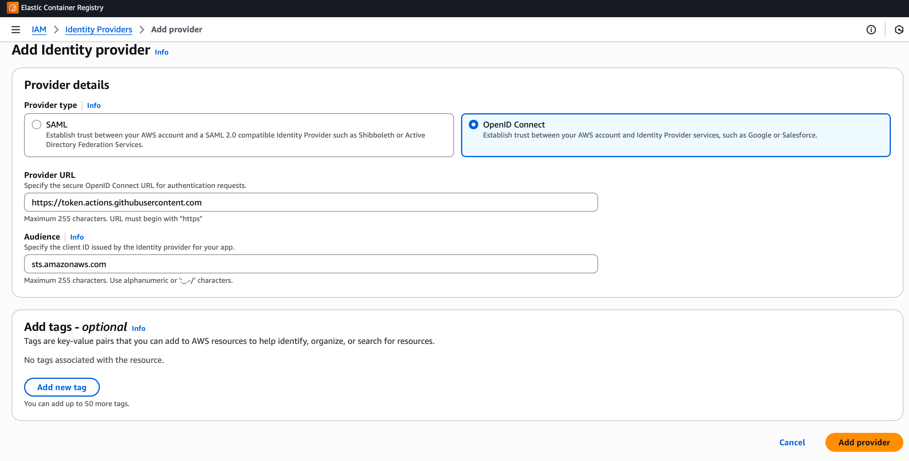

* **3.2 Create an IAM role for GitHub Actions**.

After completing step 3.1 you might get a message saying that you need to assign an IAM role to start using this provider. You can ignore this message and click the cross.

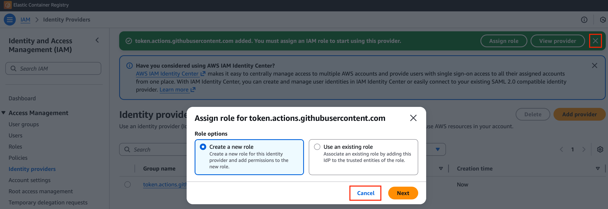

* Now that the OIDC identity provider is created, you need to create an IAM role for GitHub Actions. In the search bar type **IAM**, click on the **Roles**
  then click on **Create role**.

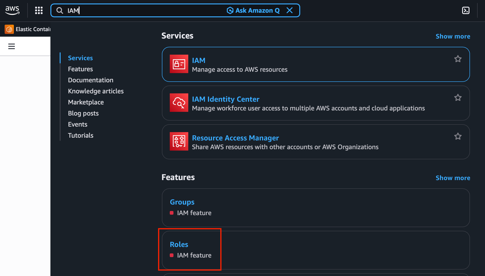

* Choose **Custom trust policy**.

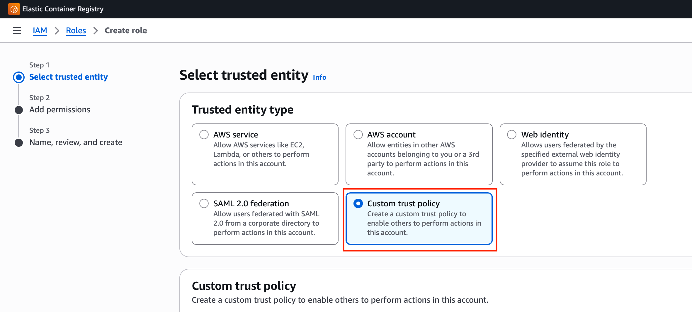

* Copy and paste the following trust policy into the text box. Replace ``YOUR_AWS_ACCOUNT_ID`` with your 12‑digit AWS account ID, ``YOUR_GITHUB_ORG_OR_USER`` 
  with your GitHub organisation or username, and ``YOUR_REPO_NAME`` with the repository that will build and push TOPAS-nBio images. For example, the official
  TOPAS-nBio image used ``repo:topas-nbio/TOPAS-nBio:ref:refs/heads/main``.
  
.. code-block:: json

   {
     "Version": "2012-10-17",
     "Statement": [
       {
         "Effect": "Allow",
         "Principal": {
           "Federated": "arn:aws:iam::YOUR_AWS_ACCOUNT_ID:oidc-provider/token.actions.githubusercontent.com"
         },
         "Action": "sts:AssumeRoleWithWebIdentity",
         "Condition": {
           "StringEquals": {
             "token.actions.githubusercontent.com:sub": "repo:YOUR_GITHUB_ORG_OR_USER/YOUR_REPO_NAME:ref:refs/heads/main",
             "token.actions.githubusercontent.com:aud": "sts.amazonaws.com"
           }
         }
       }
     ]
   }

* Next you need to choose a policy that allows pushing images to the ECR repository. In the search bar look for **AmazonElasticContainerRegistryPublicFullAccess**, 
  select it then click **Next**.

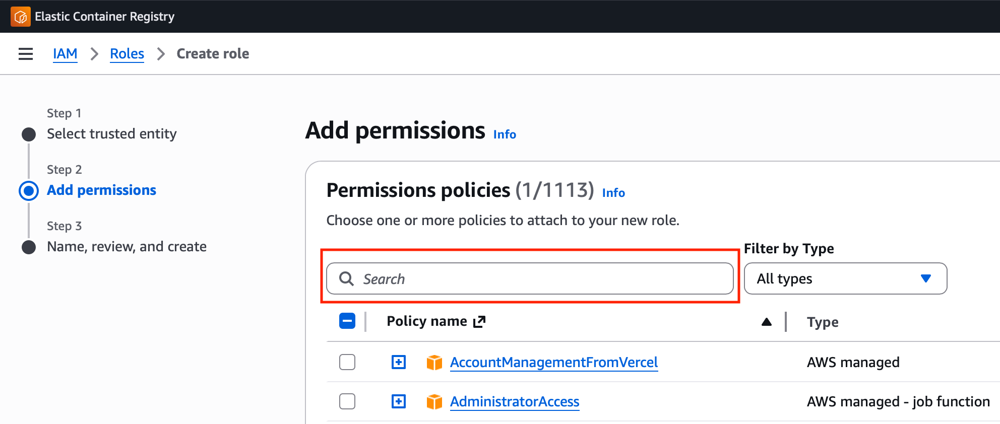

* Next you need to choose a descriptive role name (for example, **GitHubActionsECRRole**), add a description, then click **Create role**.

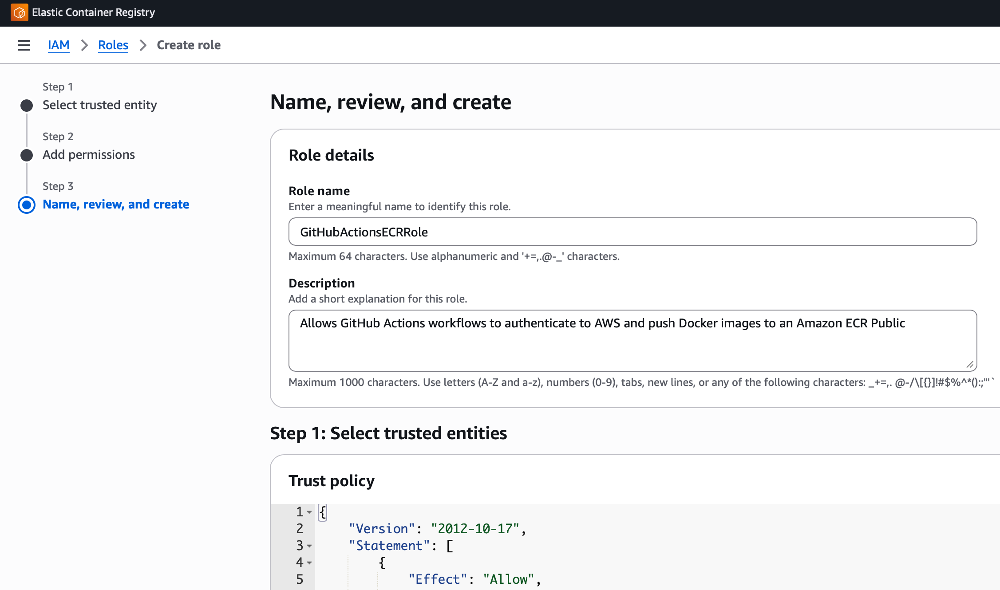

* You should now see the role in the list of roles. Click on **GitHubActionsECRRole** to open it in the console. Copy the **Role ARN** and store it somewhere safe; 
  you will need it when configuring GitHub Actions. The ARN is a globally unique identifier that tells AWS exactly which role GitHub Actions is allowed to assume, 
  similar to a full address.

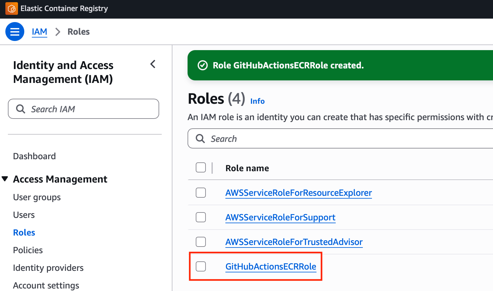

.. figure:: images/part1/9b.pdf
  :alt: GitHubActionsECRRole role ARN
  :align: center

.. _cloud_step3_3_add_github_repository_secrets:

* **3.3 Add GitHub repository secrets**.

If you chose to host your TOPAS-nBio image on AWS ECR you will need the secrets ``AWS_ROLE_ARN`` and ``ECR_REPOSITORY_URI``. If you chose to host your TOPAS-nBio 
image on Docker Hub you will need the secrets ``DOCKERHUB_USERNAME`` and ``DOCKERHUB_TOKEN``. For both cases, follow the steps below.

* In GitHub, open your repository that contains your modified TOPAS-nBio source code. Navigate to **Settings → Secrets and variables → Actions**.

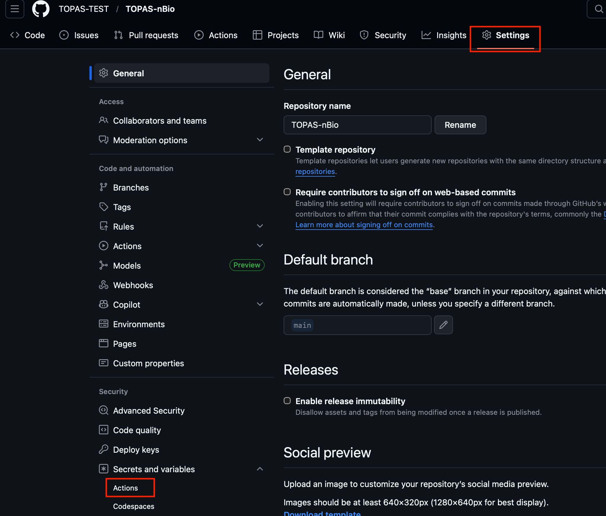

* Then click on **New repository secret** and add the secrets ``AWS_ROLE_ARN`` and ``ECR_REPOSITORY_URI`` if you are using AWS ECR, or 
  ``DOCKERHUB_USERNAME`` and ``DOCKERHUB_TOKEN`` if you are using Docker Hub.

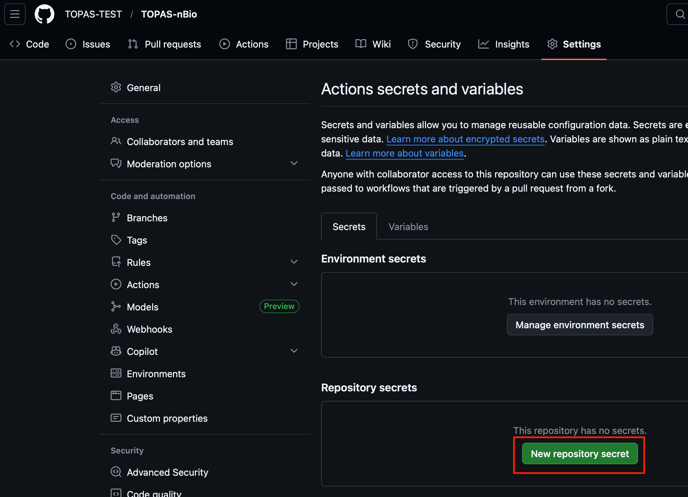

* With these secrets configured, ensure that you have the ``cloud`` folder in ``.github/workflows`` as well as ``.github/workflows/build-push-ecr.yml`` for pushing to AWS ECR,  
  or ``.github/workflows/build-push-dockerhub.yml`` for pushing to Docker Hub.
* The workflow can then be run manually by going to **Actions → Build and push to ECR** or **Actions → Build and push to Docker Hub**, then **Run workflow**.

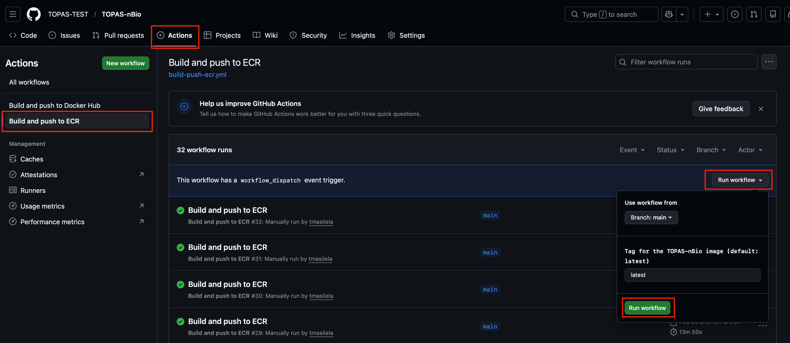

* If this was succesful you should see two images in your container registry, one for the TOPAS-nBio image and one for the postprocessing image.

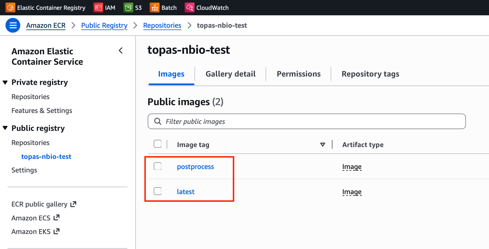

.. _pricing: https://aws.amazon.com/ecr/pricing/