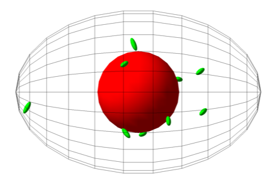
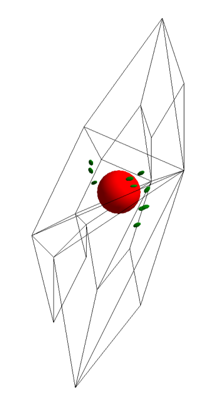
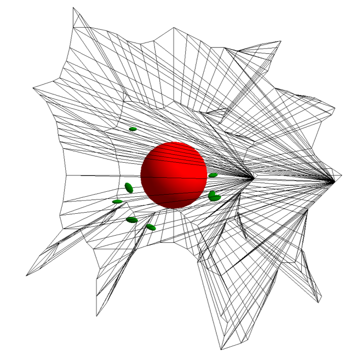
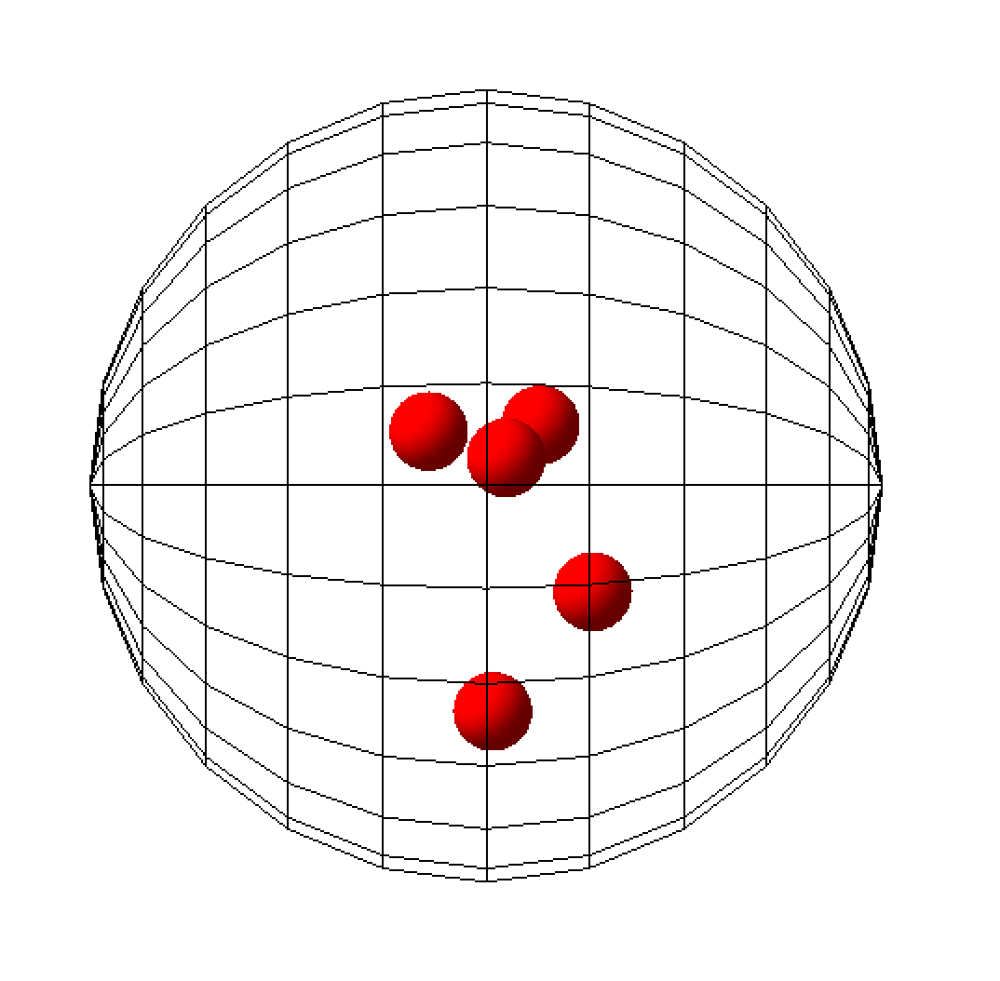
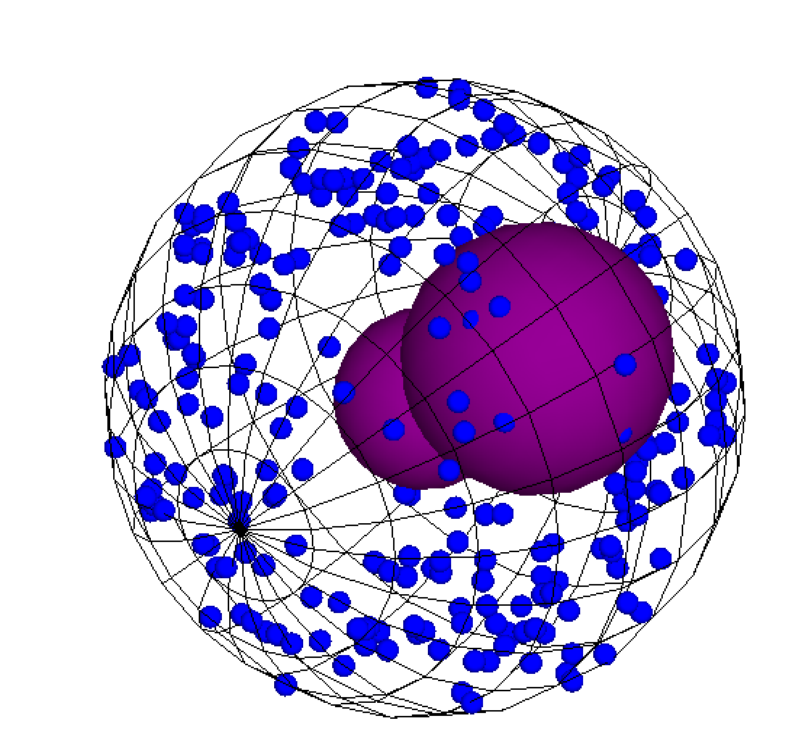
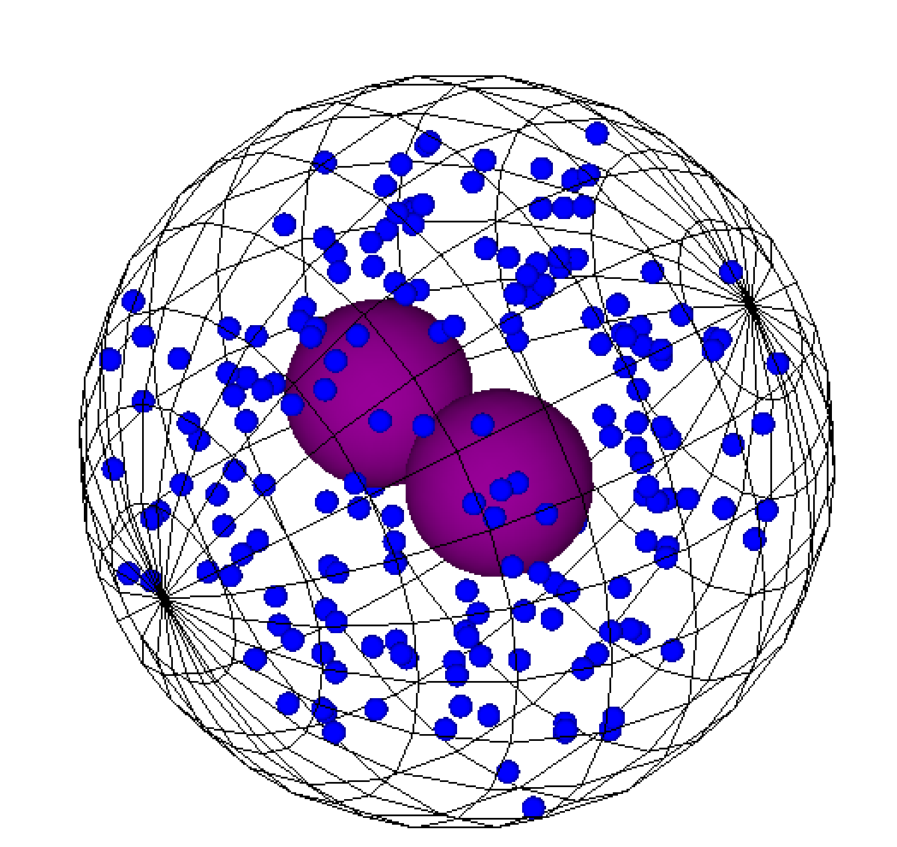
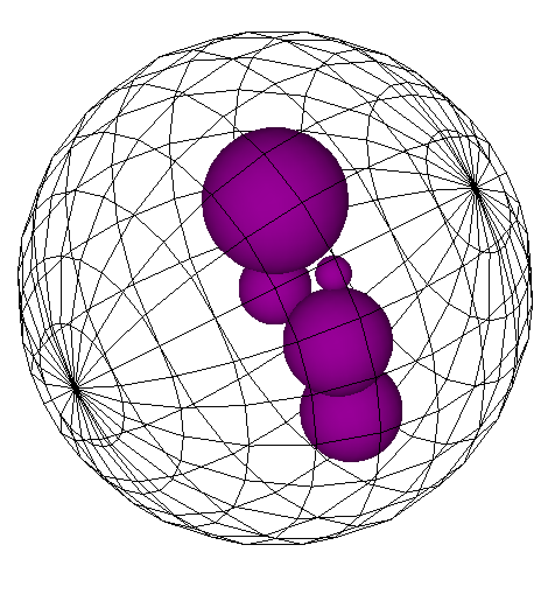

Cells
=====

A common end point of measurement for cells cultured *in vitro* in radiobiology is clonogenic cell survival. Single cell Monte Carlo simulations can provide insight into the total dose received by the cell or the distribution of dose within sub-regions of the cell (e.g., dose to the cell nucleus). This may be correlated with experimental measurements of the loss of a specific function or cell death. Single cell models can also form the geometric boundary for more complex studies, for example, calculating the energy deposited in other sub-cellular components (e.g., organelles, cell membranes) or investigating DNA damage in the nucleus. 

TOPAS-nBio provides users with a unique framework for simulating multiple cell types and the option of including organelle sub-components in the model. 

Spherical Cell
---------------
.. figure:: images/SphericalCell.png
   :width: 300
   :align: center 

The TsSphericalCell component is a model of a spherical cell with the option of including organelles. 
To create the model specify the component name as well as the cell radius required::  

  s:Ge/MyCell/Type="TsSphericalCell"
  d:Ge/MyCell/CellRadius=20 um

Users have the option of including a nucleus. Specify the radius to add the nucleus to the cell::

  d:Ge/MyCell/Nucleus/NuclRadius=5. um

Mitochondria can also be placed randomly in the cell, the size and the number of mitochondria are specified in the parameter file::

  i:Ge/MyCell/Mitochondria/NbOfMito=20
  d:Ge/MyCell/Mitochondria/a=0.5 um
  d:Ge/MyCell/Mitochondria/b=0.3 um
  d:Ge/MyCell/Mitochondria/c=0.9 um

A nucleus and mitochondria may be added to any of the cell models listed in a similar manner.

Ellipsoid Cell
--------------

The TsEllipsoidCell component is a model of an ellipsoid cell with the option of including organelles. 
To use the cell model, specify the component name as well as the semi-axis lengths of the ellipsoid:: 

  s:Ge/MyCell/Type="TsEllipsoidCell"
  d:Ge/MyCell/xSemiAxis=20 um
  d:Ge/MyCell/ySemiAxis=10 um
  d:Ge/MyCell/zSemiAxis=15 um

Cuboidal Cells
--------------
.. figure:: images/CubodialCell.png
   :width: 300
   :align: center 

The TsCuboidalCell component is a model of a cuboidal or rectangular cell with the option of including organelles. 
To use the model specify the component name as well as the half-lengths of each side of the cube/rectangle required:: 

  s:Ge/MyCell/Type="TsCuboidalCell"
  d:Ge/MyCell/Cell_HLX=10 um
  d:Ge/MyCell/Cell_HLY=20 um
  d:Ge/MyCell/Cell_HLZ=10 um

Irregular-shaped cells
----------------------

Cells with irregular-shapes are also available. This includes 3 fibroblast cell models and a 3D hexagonal cell.

.. figure:: images/FibroblastCell1.png
   :width: 300
   :align: center
 

Three models of Fibroblasts are provided in TOPAS-nBio::

  s:Ge/MyCell/Type="TsFibroblastCell1"

  s:Ge/MyCell/Type="TsFibroblastCell2"

  s:Ge/MyCell/Type="TsFibroblastCell3"		

An irregular-shaped cell using a hexagon is also available with optional organelles::

  s:Ge/MyCell/Type="TsHexagonCell"
	

Bone Cells
----------

Three different bone cell geometries are available in TOPAS-nBio: osteoblasts, osteoclasts and osteocytes.

Osteocytes and osteoblasts have the option of including a single nucleus and/or mitochondria.

.. figure:: images/Osteoblast.png
   :width: 300
   :align: center

Osteoblasts are cubical, users should specify the half-lengths of the cell:: 

  s:Ge/MyCell/Type="TsOsteoblast"
  d:Ge/MyCell/Cell_HLX=10 um
  d:Ge/MyCell/Cell_HLY=10 um
  d:Ge/MyCell/Cell_HLZ=10 um

.. figure:: images/Osteocyte.png
   :width: 300
   :align: center

Osteocytes are irregular shaped cells::
 
  s:Ge/MyCell/Type="TsOsteocyte"

Osteoclasts are large cells (50 - 120 um) with multiple nuclei. Users should specify the size of the cell, the number of nuclei and the size of the nuclei::

  s:Ge/MyCell/Type="TsOsteoclast"
  d:Ge/MyCell/CellRadius=50. um

  #Nuclei
  d:Ge/MyCell/Nucleus/NuclRadius=5. um
  i:Ge/MyCell/Nucleus/NbOfNucl=5

Blood Cells
-----------
Red blood cell (RBC) and lymphocyte geometry extensions are available in TOPAS-nBio.

.. figure:: images/RBC.png
   :width: 300
   :align: center

The red blood cell requires users to specify its radius and width (of the thickest section). The cell is modeled as a torus. Generally the radius of these cells are 6-8 um and the thickness of the torus is 1-3 um. Red blood cells do not contain any organelles::

  s:Ge/MyCell/Type="TsRedBloodCell"
  d:Ge/MyCell/RBCRadius=6 um
  d:Ge/MyCell/RBCWidth=2 um

Basophils are white blood cells that have 2-3 lobed nucleus and contain many granules. Since the nucleus is generally bilobed, the model nucleus has two lobes and users need to specify the radius of the cell. The model also has the option of including granules throughout the cytoplasm with a default radius of 0.25 um, users should specify the number of granules::

  s:Ge/MyCell/Type="TsBasophil"
  d:Ge/MyCell/BasophilRadius=7.0 um

  #Optional: include granules
  i:Ge/MyCell/Granule/NbOfGranules = 200

Eosinophils are white blood cells that are bi-lobed, also containing granules. The model also has the option of including granules throughout the cytoplasm with a default radius of 0.25 um, users should specify the number of granules::

  s:Ge/MyCell/Type="TsEosinophil"
  d:Ge/MyCell/EosinophilRadius=8.0 um

  #Optional: include granules
  i:Ge/MyCell/Granule/NbOfGranules = 200

.. figure:: images/Lymphocyte.png
   :width: 300
   :align: center

Lymphocytes are small white blood cells (leukocyte) with a single large nucleus. Users have to specify the cell radius. Nucleus radius may also be set, if not set by the user, the default radius is 4 um:: 

  s:Ge/MyCell/Type="TsLymphocyte"
  d:Ge/MyCell/LymphocyteRadius=5.0 um

  s:Ge/MyCell/Nucleus/NuclRadius=4.5 um

.. figure:: images/Monocyte.png
   :width: 300
   :align: center

Monocytes are also white blood cells with a kidney-shaped nucleus. Users need to specify the cell radius::

  s:Ge/MyCell/Type="TsMonocyte"
  d:Ge/MyCell/MonocyteRadius=10.0 um

Neutrophil are white bloods cells with a multi-lobed nucleus (3-5 lobes). Users need to specify the cell radius. The model contains a 5 lobed nucleus::

  s:Ge/MyCell/Type="TsNeutrophil"
  d:Ge/MyCell/NeutrophilRadius=7.0 um

 
Neurons
-------

.. figure:: images/Neuron.png
   :width: 500
   :align: center

In order to model realistic representations of the numerous types of neurons and supporting glial cells in the central nervous system, TOPAS-nBio has an interface to the `NeuroMorpho neuron database`_. The database contains over 60,000 neuron and glial geometries in 40 different brain regions for several different species, including rodent and human. To model a cell structure from the database, users need to download the standardized ASCII data file (in the SWC open source format for storing neuron morphologies) of the specific neuron or glial cell they wish to simulate. The standard SWC format is a text file starting with a free-text header section (denoted by the symbol #) and contains a matrix of 7 columns below the header. The standard format defines four neuron components with an integer value (1 -- soma, 2 -- axon, 3 -- basal dendrite and 4 -- apical dendrite) while values of 5+ are used for custom parameters. Note some formats extend on the standard format (SWC++) and include fork and end points as values 5 and 6, respectively.

To simulate the neuron, specify the name of the SWC file, for example::

  s:Ge/Neuron/Type="TsNeuroMorpo"
  s:Ge/Neuron/NeuroMorpoFileName="NMO_00943_prc.txt" 

A ntuple scorer specifically for neuron structures is also available::

  s:Sc/NeuronScorer/Quantity    = "NtupleForNeuron"

This ntuple scorer is an extension that can be edited by the user to add additional output parameters, depending on the application. More information on how to design custom scorers and the n-tuple format can be found on the `TOPAS custom scorers readthedocs`_. The default output of the scorer is::

  Columns of data are as follows:
  1: Position X [cm]
  2: Position Y [cm]
  3: Position Z [cm]
  4: Energy [MeV]
  5: Energy Deposited [MeV]
  6: Particle Type (in PDG Format)
  7: Track ID
  8: Run ID
  9: Event ID
 10: Volume Name
 11: Replica Number

Cell Scorer
-----------
A generic ntuple cell scorer is also provided. This scorer allows the user to do scoring in the organelles of the cell::

  #Score energy deposited in Cell components
  s:Sc/OrganelleScorer/Quantity = "NtupleForCell" 

The scorer is compatible with all the cell models and outputs the following data::

  Columns of data are as follows:
  1: Position X [cm]
  2: Position Y [cm]
  3: Position Z [cm]
  4: Energy [MeV]
  5: Energy Deposited [MeV]
  6: Particle Type (in PDG Format)
  7: Track ID
  8: Run ID
  9: Event ID
 10: Volume Name

Users may edit the NtupleForCell extension to edit or add additional output parameters. More information on how to design custom scorers and the n-tuple format can be found on the `TOPAS custom scorers readthedocs`_.

.. warning::
    Note: The DoseToWater and DoseToMaterial scorers do not work with the Geant4-DNA physics processes. Please use the DoseToMedium scorer. 

.. _TOPAS custom scorers readthedocs: https://topas.readthedocs.io/en/latest/extension-docs/scoring.html?highlight=tuple
.. _NeuroMorpho neuron database: http://neuromorpho.org

Cell Culture
------------

.. figure:: images/CellCulture.png
   :width: 100
   :align: center

TsCellCulture is a geometry extension for filling a rectangular volume with spherical cells, with a central nucleus. Users should specify the size of the container volume, the radius of the spherical cell and the radius of the spherical nucleus. The total number of cells also has to be specified::

  s:Ge/MyCulture/Type="TsCellCulture"
  s:Ge/MyCulture/Material="G4_WATER"
  s:Ge/MyCulture/Parent="World"
  d:Ge/MyCulture/Container_HLX= 100 um
  d:Ge/MyCulture/Container_HLY= 100 um
  d:Ge/MyCulture/Container_HLZ= 20 um
  i:Ge/MyCulture/NbOfCells = 20
  d:Ge/MyCulture/CellRadius=10 um
  d:Ge/MyCulture/NuclRadius= 6 um
   

An example scoring extension is also provided::

  s:Sc/CultureScorer/Quantity = "NtupleForCulture"

 
   
