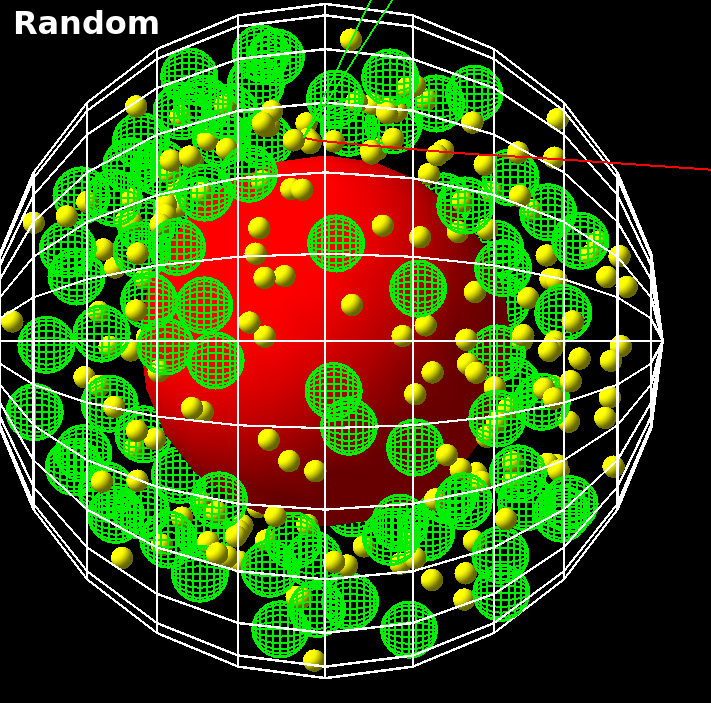
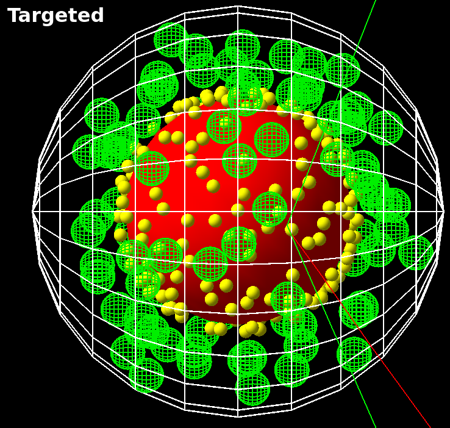

Cell Models with Organelles and targeted Nanoparticles
======================================================

The TsSphericalCellSphericalNP model allows to simulate nanoparticles  within cells together with their nucleus, mitochondria, and the cell membrane.
The nanoparticles can be distributed randomly within the cytosol, or being additionally located at the surface of different cell organelles. 

Background
----------
The dose enhancement by metallic nanoparticles can increase the biological effectiveness of radiation damage in biomolecules and tissue. To apply them effectively as radiosensitizer during cancer therapy their influence on the locally delivered dose has to be determined. Hereby, the locations of the nanoparticles within an irradiated cell influence the energy deposit in the different cell organelles, e.g. the nucleus, mitochondria, membrane and the cytosol.
TOPAS-nBio provides users with a unique framework for simulating cells including their organelle together with nanoparticles.
Details can be found in the related publication https://doi.org/10.1038/s41598-021-85964-2

Spherical Cell
--------------
The TsSphericalCellSphericalNP component is a model of a spherical cell with the option of including organelles and nanoparticles. 

.. figure:: images/SphericalCell.png
   :width: 300
   :align: center 

To create the model specify the component name as well as the radius of the cell:: 

    s:Ge/MyCell/Type="TsSphericalCellSphericalNP"
    s:Ge/MyCell/Parent="World"
    d:Ge/MyCell/CellRadius=6.0 um

 
Nucleus
-------
Users have the option to include a nucleus. Specify the radius to add the nucleus to the cell::

    d:Ge/MyCell/Nucleus/NucleusRadius= 3.3 um 
    s:Ge/MyCell/Nucleus/Color="red"
    s:Ge/MyCell/Nucleus/DrawingStyle="solid"
    
The nucleus position within the cell can be edited using::

    d:Ge/MyCell/Nucleus/translateX = 0.2 um
    d:Ge/MyCell/Nucleus/translateY = 0.0 um
    d:Ge/MyCell/Nucleus/translateZ = 0.1 um

Mitochondria
------------
Mitochondria can also be placed randomly in the cell, the radius and the number of mitochondria are specified in the parameter file::

  i:Ge/MyCell/Mitochondria/NumberbOfMitochondria=20
  d:Ge/MyCell/Mitochondria/r=0.5 um
  

Membrane
--------  
A membrane can be added to the cell by defining the thickness::

  d:Ge/MyCell/Membrane/Thickness = 10.0 nm

  
Randomly distributed Nanoparticles
----------------------------------

Nanoparticles can be distributed randomly within the cytosol by the following commands::
   
    i:Ge/MyCell/Nanoparticle/NumberOfNanoparticles = 1000000
    d:Ge/MyCell/Nanoparticle/r = 5 nm
    s:Ge/MyCell/Nanoparticle/Material = "Gold"
    s:Ge/MyCell/Nanoparticle/Color = "yellow"
    s:Ge/MyCell/Nanoparticle/DrawingStyle = "solid"

These nanoparticles are not overlapping and always placed outside of the nucleus, mitochondria and cell membrane.
    
    

Nucleus targeting Nanoparticles
-------------------------------

   
Nanoparticles located at the surface of the nucleus can be added by::
   
    i:Ge/MyCell/Nanoparticle/NumberOfNanoparticlesAtNucleus = 10000

  
  
Mitochondria targeting Nanoparticles
---------------------- ---------------

Nanoparticles located at the surface of different mitochondria can be added by::

    i:Ge/MyCell/Nanoparticle/NumberOfNanoparticlesAtMitochondria = 20000
    

    
Combination of different Nanoparticle locations
----------------------------------------------

The amount nanoparticles within the cytosol, the nucleus and at the mitochondria can be defined independently. The following example would create 1000 nanoparticles randomly distributed within the cytosol, 2000 at the surface of the nucleus, and 5000 at the surfaces randomly distributed over all mitochondria::

    i:Ge/MyCell/Nanoparticle/NumberOfNanoparticles = 1000
    i:Ge/MyCell/Nanoparticle/NumberOfNanoparticlesAtNucleus = 2000
    i:Ge/MyCell/Nanoparticle/NumberOfNanoparticlesAtMitochondria = 5000

Simulation speed
----------------
When many nanoparticles are simulated standard overlap checking can become very slow.
Since the TsSphericalCellSphericalNP model performs an analytical overlap check which is much faster than the standard Topas overlap check, the latter one can be deactivated to increase the speed of geometry construction substantially. This can be achieved by::

    b:Ge/CheckForOverlaps = "False" 
    b:Ge/CheckInsideEnvelopesForOverlaps = "False" 

For details of this parameters please compare section 7.3 of the Topas documentation.

   
Scoring
-------
An example scoring extension is provided which scores individual energy deposit events in all subcomponents of the cell::

    s:Sc/OrganelleScorer/Quantity = "OrganelleScorer"
    s:Sc/OrganelleScorer/Component = "MyCell"
    
Literature
------------
If you use this extension please cite the following article which provides additional details::
    Hahn, M.B., Zutta Villate, J.M. (2021). Combined cell and nanoparticle models for TOPAS to study radiation dose enhancement in cell organelles. Sci Rep 11(1): 6721. PMID: 33762596. PMCID: PMC7990972. https://doi.org/10.1038/s41598-021-85964-2
    
 
   
