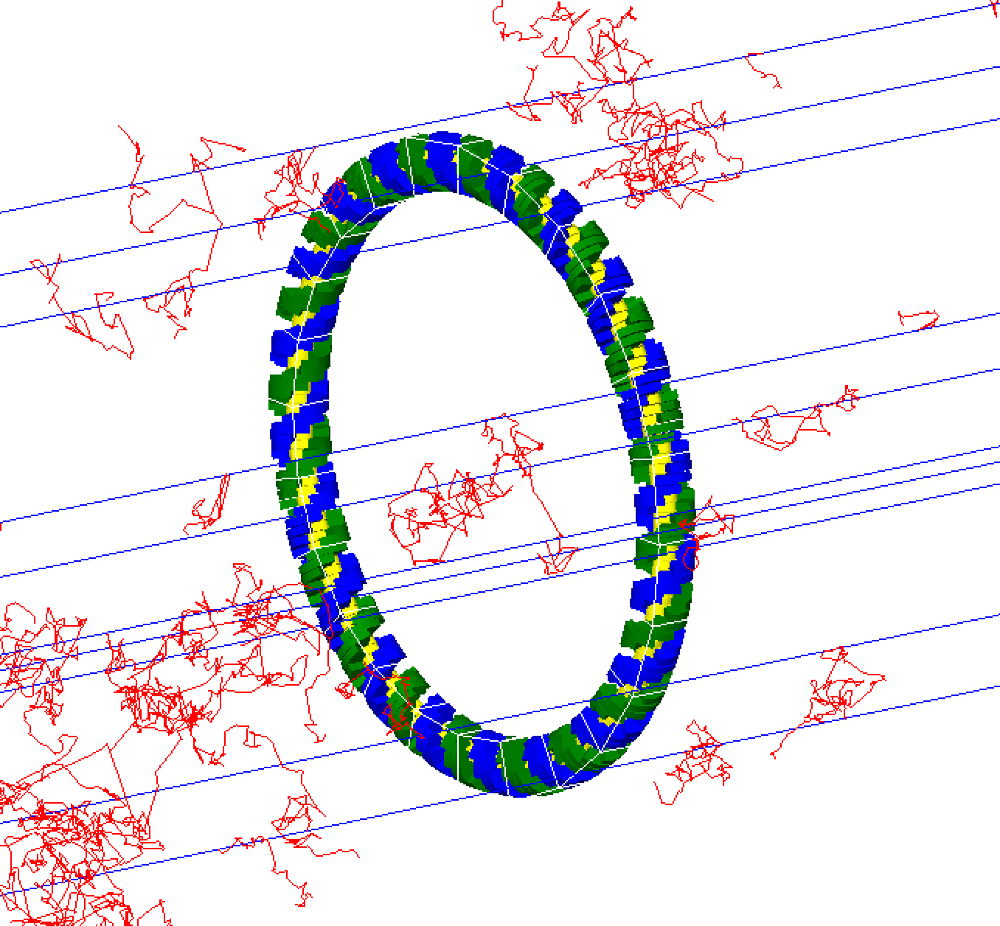

DNA models
===========
Undeniably the nucleus and the genome it contains is the primary radiation target in the cell and of vital importance in most radiobiology studies. Accurate models of the spatial and temporal distribution of radiation induced damage, in the form of DSBs or lesions, on the full DNA structure and its successive evolution is essential for formulating a full understanding of the biological effects of radiation. 

Simple Cylindrical Targets
--------------------------

.. figure:: images/CylinderDNA.png
   :width: 300
   :align: center 

DNA has been modeled with Monte Carlo simulations for the last three decades. Originally, energy depositions were modeled within simple cylindrical targets representing DNA stands, nucleosomes or chromatin fibers in order to compare to the experimental microdosimetry data. 

Three simple cylindrical target geometries are available, these represent a chromatin fiber (yellow), nucleosome (red) and DNA strand (green), respectively::

  s:Ge/MyChromatin/Type="TsCylindericalChromatin"
  s:Ge/MyNucleosome/Type="TsCylindericalNucleosome"
  s:Ge/MyDNA/Type="TsCylindericalDNA"  

The size of the cylinders are set to fixed sizes of the representative geometry. For the DNA strand this is a length of 2 nm with a diameter of 2 nm, the nucleosome has a length of 10 nm and diameter of 5 nm while the chromatin fiber has a length of 25 nm and diameter of 25 nm. However, users do have the option of specifying new dimensions for each component with the following parameters::

  d:Ge/MyChromatin/ChromatinHalfLength=12.5 nm
  d:Ge/MyChromatin/ChromatinRadius=12.5 nm

  d:Ge/MyNucleosome/NucleosomeHalfLength=5 nm
  d:Ge/MyNucleosome/NucleosomeRadius=2.5 nm
  	
  d:Ge/MyDNA/DNAHalfLength=1 nm
  d:Ge/MyDNA/DNARadius=1 nm

Charlton DNA Model
------------------

.. figure:: images/Charlton.png
   :width: 300
   :align: center 

The TsCharltonDNA model is based on a simple combination of cylinders. The inner cylinder has a diameter of 1 nm and length of 0.34 nm, representing the basepair of the DNA strand. Two surrounding half-cylinders represent the sugar phosphate backbone of the DNA; these are each rotated by 36 degrees on adjacent base-pairs. Users have to specify the number of base pairs to be simulated:: 

  s:Ge/MyDNA/Type="TsCharltonDNA"
  i:Ge/MyDNA/NumberofBasePairs=10

Linear DNA Model
----------------

A similar model to the above Charlton DNA model is called TsLinearDNA which also models the DNA basepair as a cylinder of diameter 1 nm and length 0.34 nm, but models the sugar phosphate backbone as two quarter cylinders opposite each other with an outer diameter of 2.37 nm, rotated by 36 degrees on each subsequent basepair:: 

  s:Ge/MyDNA/Type="TsLinearDNA"
  i:Ge/MyDNA/NumberofBasePairs=10

Circular Plasmid
----------------

TsPlasmid is a simple circular plasmid. The DNA has the same structure as the linear DNA model but arranged in a ring. Each DNA segment consists of a central cylindrical basepair (diameter 1 nm and length 0.34 nm) surrounded by two quarter cylinders (diameter 2.37 nm) for the sugar phosphate backbone. Users have to specify the number of basepairs::

  s:Ge/CircularPlasmid/Type     = "tsplasmid"
  #Define the number of base pairs in the ring
  i:Ge/CircularPlasmid/NumberOfBasePairs = 2000

Geant4-DNA Full Nuclear Model
-----------------------------
The Geant4-DNA model represents the whole genome (6 x 10^9 bps) within an ellipsoid nucleus for a cell in the G0/G1 phase and is further described in Dos Santos M et al. (2014) Progress in Nuclear Science and Technology 4, 449–453.

The DNA double helix strands are composed of two separate strands built from the union of spheres. The sugar-phosphate backbone of the DNA has a total diameter of 2.16 nm and the DNA base, within the backbone structure, has a diameter of 0.34 nm. The double helix is used to form a nucleosome which consists of a core histone protein (cylinder with diameter 6.5 nm and length of 5.7 nm) wrapped by two turns of the DNA double helix (a total of 200 bps). The chromatin fibre is represented by a cylinder of diameter 30.8 nm and length 161 nm. Each fibre contains 90 nucleosomes which are placed on a helix. To represent the chromatin loops, 7 chromatin fibers are arranged in a "flower" shape. The flower has 7 "petals", with each composed of 4 fibers arranged in a diamond. The flower substructures fill 23 chromosome territories, each represented by a box of varying size. 

