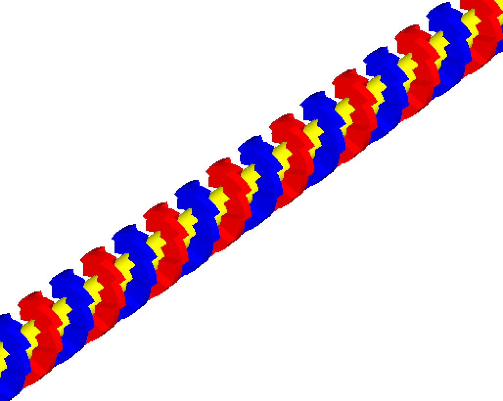
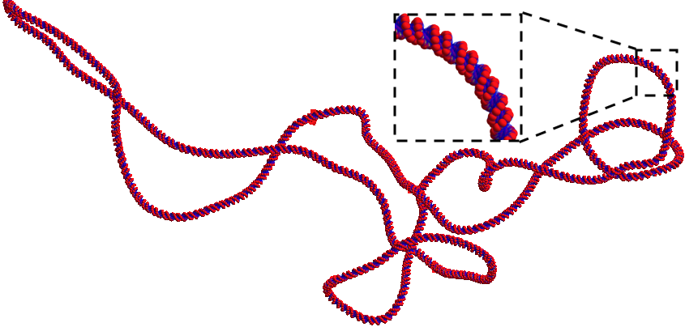

DNA Models
===========
Undeniably the nucleus and the genome it contains is the primary radiation target in the cell and of vital importance in most radiobiology studies. Accurate models of the spatial and temporal distribution of radiation induced damage, in the form of DSBs or lesions, on the full DNA structure and its successive evolution is essential for formulating a full understanding of the biological effects of radiation. 

Simple Cylindrical Targets
--------------------------

.. figure:: images/CylinderDNA.png
   :width: 300
   :align: center 

DNA has been modeled with Monte Carlo simulations for the last three decades. Originally, energy depositions were modeled within simple cylindrical targets representing DNA stands, nucleosomes or chromatin fibers in order to compare to the experimental microdosimetry data [Nikjoo1989]_ [Nikjoo1991]_. 

Three simple cylindrical target geometries are available, these represent a chromatin fiber (yellow), nucleosome (red) and DNA strand (green), respectively::

  s:Ge/MyChromatin/Type="TsCylindericalChromatin"
  s:Ge/MyNucleosome/Type="TsCylindericalNucleosome"
  s:Ge/MyDNA/Type="TsCylindericalDNA"  

The size of the cylinders are set to fixed sizes of the representative geometry. For the DNA strand this is a length of 2 nm with a diameter of 2 nm, the nucleosome has a length of 10 nm and diameter of 5 nm while the chromatin fiber has a length of 25 nm and diameter of 25 nm. However, users do have the option of specifying new dimensions for each component with the following parameters::

  d:Ge/MyChromatin/ChromatinHalfLength=12.5 nm
  d:Ge/MyChromatin/ChromatinRadius=12.5 nm

  d:Ge/MyNucleosome/NucleosomeHalfLength=5 nm
  d:Ge/MyNucleosome/NucleosomeRadius=2.5 nm
  	
  d:Ge/MyDNA/DNAHalfLength=1 nm
  d:Ge/MyDNA/DNARadius=1 nm

Charlton DNA Model
------------------

.. figure:: images/Charlton.png
   :width: 300
   :align: center 

The TsCharltonDNA model is based on a simple combination of cylinders. More details can be found in Charlton et al. (1989) [Charlton1989]_. The inner cylinder has a diameter of 1 nm and length of 0.34 nm, representing the basepair of the DNA strand. Two surrounding half-cylinders represent the sugar phosphate backbone of the DNA; these are each rotated by 36 degrees on adjacent base-pairs. Users have to specify the number of base pairs to be simulated:: 

  s:Ge/MyDNA/Type="TsCharltonDNA"
  i:Ge/MyDNA/NumberOfBasePairs=10

Linear DNA Model
----------------

A similar model to the above Charlton DNA model is called TsLinearDNA which also models the DNA basepair as a cylinder of diameter 1 nm and length 0.34 nm, but models the sugar phosphate backbone as two quarter cylinders opposite each other with an outer diameter of 2.37 nm, rotated by 36 degrees on each subsequent basepair:: 

  s:Ge/MyDNA/Type="TsLinearDNA"
  i:Ge/MyDNA/NumberOfBasePairs=10

Circular Plasmid
----------------

.. figure:: images/Plasmid.png
   :width: 300
   :align: center 

TsPlasmid is a simple circular plasmid. The DNA has the same structure as the linear DNA model but arranged in a ring. Each DNA segment consists of a central cylindrical basepair (diameter 1 nm and length 0.34 nm) surrounded by two quarter cylinders (diameter 2.37 nm) for the sugar phosphate backbone. Users have to specify the number of basepairs::

  s:Ge/CircularPlasmid/Type     = "TsPlasmid"
  #Define the number of base pairs in the ring
  i:Ge/CircularPlasmid/NumberOfBasePairs = 2000

Supercoiled Plasmid
-------------------

.. figure:: images/SupercoiledPlasmid.png
   :width: 300
   :align: center 

TsSupercoiledPlasmid is a supercoiled plasmid defined from an ascii file that contains the vertex position (in nm) of a deformed polygon that forms the supercoiled path. Different configurations of DNA can be chosen: half cylinders (HalfCylinder), quarter cylinders - similar to the circular plasmid (QuarterCylinder) or spheres (Sphere). The DNA consists of the sugar phosphate backbone and base. Users have to specify the file name of the ascii file that contains the vertex of the deformed polygon forming the supercoiled plasmid. We provide two files pBR322_a.xyz and pBR322_b.xyz. For these files, supercoiling is achieved using the Vologodskii methodology [Vologodskii1994]_::

  s:Ge/SupercoiledPlasmid/Type     = "TsPlasmidSupercoiled"
  #Define the file name 
  i:Ge/SupercoiledPlasmid/FileName = "pBR322_a.xyz"
  # Define the DNA model
  s:Ge/SupercoiledPlamid/DNA_Model = "QuarterCylinder" # HalfCylinder or Sphere

If each coordinate in the ascii file belongs to a single basepair of the plasmid, then the following must be set:: 
  
  b:Ge/SupercoiledPlamid/SegmentPlasmidPath = "False" # Default False

Otherwise, the deformed polygon is segmented using units of 0.34 nm and smoothed.

IRT Supercoiled Plasmid
-----------------------

TsIRTSupercoiledPlasmid is a supercoiled plasmid geometry defined from a DnaFabric [Meylan2016]_ file (.fab2g4dna) that contains the 
plasmid information in a volume by volume manner. This geometry can be used for regular energy deposit simulations to account
for DNA Strand Breaks due to physical interactions and for indirect DNA Strand Breaks using the IRT scorers. The geometry is
made using six cut spheres using the solid Booleans method from Geant4 which increases the geometry initialization time but 
gives a smooth plasmid. The following parameters are necessary for the use of this geometry, the enclosure radius, the DnaFabric 
input file and a plasmid location and rotation::

  s:Ge/IRTSupercoiledPlasmid/Type = "TsIRTPlasmidSupercoiled"
  d:Ge/IRTSupercoiledPlasmid/R = 0.5 um
  s:Ge/IRTSupercoiledPlasmid/InputFile = "pUC19.fab2g4dna"
  s:Ge/IRTSupercoiledPlasmid/EnvelopeFile = "Plasmid_Envelope.xyz"
  i:Ge/IRTSUpercoiledPlasmid/NumberOfPlasmids = 5

The ``Plasmid_Envelope.xyz`` file can be done by hand by a user, it is a file containing the position x, y and z and the rotations 
of a set of plasmids. However, we recommend the use of a pre simulation setup tool called TsIRTSupercoiledPlasmidSetup to aid in 
this task. This tool is further explained in :ref:`IRT Supercoiled Plasmid Setup`.
The number of lines in the ``Plasmid_Envelope.xyz`` file must be greater or equal to the ``NumberOfPlasmids`` parameter.

We provide one pUC19 plasmid in DnaFabric format called “pUC19_20C_3Sigma_ALP_Corrected.fab2g4dna” generated using Brownian Dynamics 
[Ermak1978]_ with a temperature of 20 degrees Celsius and -0.03 super helix density. This plasmid is the one shown at the start of 
this section.

Solenoid Chromatin Fiber Model
------------------------------
TsSolenoidFiber is a chromatin fiber model, based on a solenoid geometry, described in Henthorn et al. (2017) [Henthorn2017a]_.

.. figure:: images/SolenoidFiber1.png
   :width: 300
   :align: center 

By default the model of the double helix has backbones and bases modeled as spheres wrapped around a cylindrical histone protein. The radius of the base sphere is 0.208 nm, while the backbone sphere had a radius of 0.240 nm. Users can also specify to build the DNA backbone and base volumes as half cylinders, described by Charlton, Nikjoo and Humm (1989) [Charlton1989]_, or as quarter cylinders, as described by Bernal and Liendo (Med. Phys. 2009) [Bernal2009]_. The histone radius is 3.3 nm with a length of 5.7 nm. The double helix structure is wrapped around cylindrical histones in 1.65 left-handed turns to form the nucleosome. These are arranged in a solenoid chromatin conformation, with 6 histones per turn of the fiber. Each fiber contains 61 histones and ~10.8 kbp of DNA.
 
Users can set the fiber radius and length::

  d:Ge/Fiber/FiberHalfLength = 80.0 nm
  d:Ge/Fiber/FiberRadius = 18.5 nm
 
Users can change the number of histones per turn::

  i:Ge/Fiber/NumberOfHistonesPerTurn = 6
 
Users can change the DNA volume geometry, by including one of the below::

  s:Ge/Fiber/DNA_Model = Sphere            #Described by Bertolet et al. (2022)
  s:Ge/Fiber/DNA_Model = HalfCylinder      #Described by Charlton, Nikjoo and Humm (1989)
  s:Ge/Fiber/DNA_Model = QuarterCylinder   #Described by Bernal and Liendo (2009)

Note that as of v1.1, the sphere model is slightly different from the one in v1.0. Also, different models for the hydration shell around these three DNA models have been added. See Bertolet et al. 2022 [Bertolet2022]_ for more details. Also,  

Two different scorers are provided for the TsSolenoidFiber; NtupleForBasePair and NtupleForSpatial. Both of these are described in more detail here.
 

Geant4-DNA Full Nuclear Model
-----------------------------

.. figure:: images/Geant4WholeNucleus.png
   :width: 300
   :align: center

The Geant4-DNA model represents the whole genome (6 x 10^9 bps) within an ellipsoid nucleus for a cell in the G0/G1 phase and is further described in Dos Santos M et al. (2014) [DosSantos2014]_.

The DNA double helix strands are composed of two separate strands built from the union of spheres. The sugar-phosphate backbone of the DNA has a total diameter of 2.16 nm and the DNA base, within the backbone structure, has a diameter of 0.34 nm. The double helix is used to form a nucleosome which consists of a core histone protein (cylinder with diameter 6.5 nm and length of 5.7 nm) wrapped by two turns of the DNA double helix (a total of 200 bps). The chromatin fiber is represented by a cylinder of diameter 30.8 nm and length 161 nm. Each fiber contains 90 nucleosomes which are placed on a helix. To represent the chromatin loops, 7 chromatin fibers are arranged in a "flower" shape. The flower has 7 "petals", with each composed of 4 fibers arranged in a diamond. The flower substructures fill 23 chromosome territories, each represented by a box of varying size. 

Users need to include the files of data specifying the position of the chromosome territories within the nucleus. These files are named chromo*.dat (24 files total). 

To build the full DNA hierarchy, the flags to specify the building of the chromatin fibers and the basepairs should be set to true::  

  s:Ge/MyCell/Type="tsdna"
  b:Ge/MyCell/BuildChromatinFiber="true"
  b:Ge/MyCell/BuildBases="true" 

References
----------

.. [Nikjoo1989] Nikjoo H, Goodhead DT, Charlton DE & Paretzke HG 1989. 
       Energy deposition in small cylindrical targets by ultrasoft X-rays Phys. Med. Biol. 34(6), 691–705.

.. [Nikjoo1991] Nikjoo H, Goodhead DT, Charlton DE & Paretzke HG 1991. 
       Energy deposition in small cylindrical targets by monoenergetic electrons Int. J. Radiat. Biol. 60(5), 739–756.

.. [Charlton1989] Charlton DE, Nikjoo H & Humm JL 1989. Calculation of initial yields of single- and double-strand breaks in 
       cell nuclei from electrons, protons and alpha particles Int. J. Radiat. Biol. 56(1), 1–19.

.. [Vologodskii1994] Vologodskii AV & Cozzarelli NR 1994. Conformational and thermodynamic properties of supercoiled DNA Annu. 
       Rev. Biophys. Biomol. Struct. 23, 609-643.

.. [Meylan2016] Meylan, S., Vimont, U., Incerti, S., Clairand, I., Villagrasa, C. 2016. 
       Geant4-DNA simulations using complex DNA geometries generated by the DnaFabric tool. 
       Computer Physics Communications, 204, 159–169. https://doi.org/10.1016/j.cpc.2016.02.019

.. [Ermak1978] Ermak D L, McCammon J A 1978. Brownian dynamics with hydrodynamic interactions. 
       The Journal of Chemical Physics, 69(4), 1352–1360. https://doi.org/10.1063/1.436761

.. [Henthorn2017a] Henthorn NT, Warmenhoven JW, Sotiropoulos M, Mackay RI, Kirkby KJ & Merchant MJ 2017.
       Nanodosimetric simulation of direct ion-induced DNA damage using different chromatin 
       geometry models. Radiation Research, 188, 770-783.

.. [Bernal2009] Bernal & Liendo 2009. An investigation on the capabilities of the PENELOPE MC code 
       in nanodosimetry Med. Phys. 36(2), 620-625.

.. [DosSantos2014] Dos Santos M, Villagrasa C, Clairand I & Incerti S 2014. Influence of the chromatin 
       density on the number of direct clustered damages calculated for proton and alpha 
       irradiations using a Monte Carlo code Progress in Nuclear Science and Technology 4, 449–453.

.. [Bertolet2022] Bertolet, A., Ramos-Mendez, J., McNamara, A., Yoo, D., Ingram, S., Henthorn, N., Warmenhoven, J. W., Faddegon, B., Merchant, M., McMahon S. J. (2022). Impact of DNA geometry and scoring on Monte Carlo track-structure simulations of initial radiation induced damage. Radiation Research, 2022;198(3):207-220.  PMID: 35767729  PMCID: PMC9458623.
