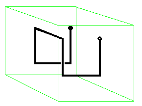

Nucleus Model
===================

The last release of TOPAS-nBio provides a model of a cell nucleus as a sphere uniformly filled with DNA. The nucleus is created and dimensionated by the parameter::

  s:Ge/Nucleus/Type                       = "TsNucleus"
  s:Ge/Nucleus/Parent                     = "World"
  d:Ge/Nucleus/NucleusRadius              = 4.65 um

The built DNA is structured in fibers as shown in `DNAModels readthedocs`_.

.. figure:: images/SolenoidFiber1.png
   :width: 300
   :align: center 

DNA models
-----------

Fibers are composed of linked double helix with backbones and bases that can be modeled as quarter cylinders, half cylinders or spheres (see `DNAModels readthedocs`_). This can be specified by the user using the parameter::

  s:Ge/Nucleus/DNAModel = "QuarterCylinder"
  
and the options "HalfCylinder" and "Sphere", respectively. Besides bases and backbones, hydration shells around double helices can be added to account for close ionizations that may be translated into backbone breaks (see `Nucleus Scorer readthedocs`_). The thickness of the hydration shell can be controlled using:

  d:Ge/Nucleus/HydrationShellThickness = 0.16 nm
  
DNA is wrapped around cylindrical histones (length of 3.3 nm and length of 5.7 nm), which in turn form a solenoid chromatin using 6 histones per turn of the fiber. The length and the radius of a fiber can be specified by users::

  d:Ge/Nucleus/FiberRadius = 18.5 nm
  d:Ge/Nucleus/FiberLength = 120.0 nm
  
Hilbert curve and geometry information
--------------------------------------

These cylindrical fibers are linked using the `Hilbert curve`_ to fill the space with linked DNA structures. The files 'supportFiles/HilbertPoints_iteration*.dat' are provided, containing the position of the vertices of several iterations of the Hilbert curve to connect different fibers. For example, the first iteration is represented by

The Hilbert curve can be repeated through different layers -generating a voxel- and then repeated this voxel in the 3D space to fill the whole nucleus. Users can control these features through the parameters::

  s:Ge/Nucleus/HilbertCurveFileName       = "supportFiles/HilbertPoints_iteration1.dat"
  i:Ge/Nucleus/HilbertCurveLayer          = 4
  i:Ge/Nucleus/HilbertCurve3DRepeat       = 30
  
where 'HilbertCurve3DRepeat' represents the number of repetitions in a single direction, so if 30 is specified, a total of 30x30x30 = 27000 voxels is obtained. The size of these voxels is indirectly controlled by the previous 5 parameters, considering that the distance between points of a Hilbert curve is given by the fiber length plus 40 nm. The spherical nucleus intersect then this rectangular strucuture of voxels, and the geometrical information about which parts of the DNA is contained within the nucleus and the assignation of each base pair to different chromosomes needs to be specified in separated files ('supportFiles/Geoinfo.txt', 'supportFiles/CopyNoTable.txt' and 'supportFiles/signedCHVoxel.txt') when scoring damage to the nucleus (see `Nucleus Scorer readthedocs`_). Therefore, to modify any of the previous parameters is not recommended, and should be only performed if users can make sure that the geometrical information in those files is updated.

The provided configuration gives a nucleus with 6.078 Gbp, as each fiber contains 15,150 bp, each voxel 4.242 Mbp. 14328 of the voxels are contained within the nucleus.

Optional building of substructures and materials for the scorer
----------------------------------------------------------------
Users can control whether they want to include bases, backbones, hydration shells and histones working as scavengers of chemical reactive species using the parameters::

  b:Ge/Nucleus/AddBases                   = "true"
  b:Ge/Nucleus/AddBackbones               = "true"
  b:Ge/Nucleus/AddHydrationShell          = "true"
  
In order for the scorer to account hits in the desired structures of the DNA, the materials for bases, backbones, hydration shells of both strands and for the histones to work as scavengers need to be different from 'G4_WATER' used for the rest of the nucleus, even though if they are just copies, as specified in `Nucleus Scorer readthedocs`_. In the provided example, we use the following configuration::

  s:Ma/G4_HistoneMaterial/CloneFromMaterial   = "G4_WATER"
  d:Ma/G4_HistoneMaterial/CloneWithDensity    = 1.407 g/cm3
  s:Ge/Nucleus/Histone/Material               = "G4_HistoneMaterial"
  
  s:Ma/G4_BaseMaterial/CloneFromMaterial      = "G4_WATER"
  d:Ma/G4_BaseMaterial/CloneWithDensity       = 1.0 g/cm3
  s:Ge/Nucleus/Base1/Material                 = "G4_BaseMaterial"
  s:Ge/Nucleus/Base2/Material                 = "G4_BaseMaterial"
  
  s:Ma/G4_BackboneMaterial/CloneFromMaterial  = "G4_WATER"
  d:Ma/G4_BackboneMaterial/CloneWithDensity   = 1.0 g/cm3
  s:Ge/Nucleus/Backbone1/Material         = "G4_BackboneMaterial"
  s:Ge/Nucleus/Backbone2/Material         = "G4_BackboneMaterial"
  
  s:Ma/G4_WATER_MODIFIED/CloneFromMaterial    = "G4_WATER"
  d:Ma/G4_WATER_MODIFIED/CloneWithDensity     = 1.0 g/cm3
  s:Ge/Nucleus/HydrationShell1/Material   = "G4_WATER_MODIFIED"
  s:Ge/Nucleus/HydrationShell2/Material   = "G4_WATER_MODIFIED"

.. _DNAModels readthedocs: https://topas-nbio.readthedocs.io/en/latest/Geometries/DNAmodels.html
.. _Hilbert curve: https://en.wikipedia.org/wiki/Hilbert_curve
.. _Nucleus Scorer readthedocs: https://topas-nbio.readthedocs.io/en/latest/Scorers/Nucleus.html
