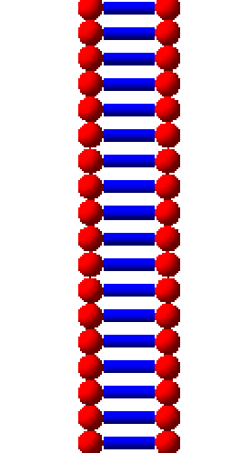
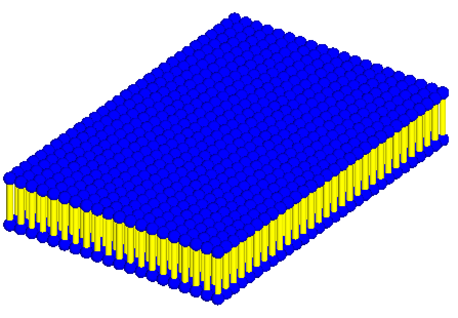

Other Models
============
Recent experimental evidence is challenging the DNA-centric model of radiobiology and suggesting the full effect of radiation may not be initiated from DNA damage exclusively. Experiments in which the cytoplasm is irradiated, while the nucleus is spared, suggest that radiation induced damage in extra-nuclear cell structures may also be of importance for developing a comprehensive model of the cellular response to radiation. Some targets, other than DNA, are also included in TOPAS-nBio.

Membranes
---------

A lipid bilayer is created in TOPAS-nBio consisting of two hydrophilic heads, each a sphere of radius ~2 nm, and a tail region consisting of a cylinder of radius ~1 nm and length of ~2 nm. The total thickness of the membrane is between 7 - 10 nm. All dimensions are changeable parameters::

  d:Ge/MyCell/LipidHeadRadius=1. nm
  d:Ge/MyCell/LipidTailHalfLength=3. nm
  d:Ge/MyCell/LipidTailRadius=0.5 nm

The membrane can be formed as a ring or a layer generated by the base elements i.e. the lipid unit::

  s:Ge/MyCell/Type="TsMembraneLayer"

  //or

  s:Ge/MyCell/Type="TsMembraneRing"

For the ring geometry the number of lipids forming the ring should be specified::

  i:Ge/MyCell/NumberOfLipids=50

A membrane layer configuration is also available using the TsMembraneLayer extension geometry. This forms a grid of the lipid unit and the number of rows and columns should be specified::

  i:Ge/MyCell/NumberOfRows=20
  i:Ge/MyCell/NumberOfColumns=30

Transmembrane proteins, which represent ion channels or communication proteins can also be included in the membrane layers. 

.. figure:: images/IonChannel.png
   :width: 300
   :align: center 

Ion channels are generally formed by three or more protein subunits. The TsIonChannel extension models a complex ion channel consisting of 5 protein sub-units of length 40 nm (modeled as cylinders, each with a 5 nm radius) arranged in a circle within the membrane layer. Users need to specify the bilayer parameters as well as the number of rows and columns in the membrane layer::

  s:Ge/MyCell/Type="TsIonChannel"

  i:Ge/MyCell/NumberOfRows=50
  i:Ge/MyCell/NumberOfColumns=50

.. figure:: images/Channel.png
   :width: 300
   :align: center 

Communication proteins consist of a single protein structure and are modeled as a single cylinder with the TsChannel extension. The number of rows and columns in the membrane should be specified, as well as the inner and outer radii of the membrane channel (Rmin and RMax, respectively) and the half-length of the protein channel::

  s:Ge/MyCellType="TsChannel"
 
  i:Ge/MyCell/NumberOfRows=100
  i:Ge/MyCell/NumberOfCols=50

  d:Ge/MyCell/ChannelRmax = 10 nm
  d:Ge/MyCell/ChannelRmin = 2 nm
  d:Ge/MyCell/ChannelHalfLength = 20 nm

Mitochondria
------------

.. figure:: images/Mitochondria.png
   :width: 300
   :align: center

Mitochondria are the only sites of extra-nuclear DNA in eukaryotic cells. Mitochondrial DNA (mt-DNA) in humans contains ~ 16569 bps encoding 37 genes and unlike nuclear DNA, which is linear, mt-DNA is circular.

Mitochondria are generally ellipsoid shaped and can be modeled using the G4Ellipsoid geometry type. The semi-axis lengths (HLX, HLY and HLZ) of the ellipsoid must be specified. mt-DNA may be included in the model, modeled as either a circular or non-circular plasmid using the TsPlasmid extensions, for example::

  # Mitochondria
  s:Ge/MyMito/Type              = "G4Ellipsoid"
  d:Ge/MyMito/HLX               = 0.5 um
  d:Ge/MyMito/HLY               = 1 um
  d:Ge/MyMito/HLZ               = 0.4 um

  s:Ge/mDNA/Type     = "tsplasmid"
  #Define the number of base pairs in the ring
  i:Ge/mDNA/NumberOfBasePairs = 200
  s:Ge/mDNA/Parent = "MyMito"

Proteins
--------
The `protein data bank`_ (PDB) contains over 130,000 biological macromolecular 3D structures, including proteins and nucleic acids. Many of these proteins are essential to normal cellular function, and precise modeling of the spatial distribution in a realistic molecular model can aid in extending our understanding of the effect of radiation. 

.. _protein data bank: https://www.rcsb.org

IRT Supercoiled Plasmid Setup
-----------------------------
IRT plasmid Strand Break simulations need the information of the chemical species within the DNA that react in order to properly simulate indirect
Strand Breaks. Such information is provided using a ``Plasmid.xyz`` file. The physical information for direct 
Strand Breaks is handled by Geant4, which only needs the location and rotation of the plasmid geometries in the form of an ``Envelope.xyz`` file.
The user can create both files by hand or by using an external tool. TOPAS-nBio provides a tool to automatize this process 
in a pre-simulation using the TsIRTPlasmidSupercoiledSetup geometry. The example ``TsDNAPlasmidSetup.txt`` illustrates the use this tool.
The following parameters must be given to the TsIRTPlasmidSupercoiledSetup component::

  # Water Envelope Size
  d:Ge/plasmid/R = 0.5 um

  # Number of Plasmids
  i:Ge/plasmid/NumberOfPlasmids = 5

  # The DnaFabric file with the plasmid information
  s:Ge/plasmid/InputFile  = "pUC19_20C_3Sigma_ALP_Corrected.fab2g4dna"

  # The output file
  s:Ge/plasmid/OutputFile = "Plasmid_50ugg_Sphere_1um_diameter"

The TsPlasmidSupercoiledSetup component will generate two files: ``Output_plasmids.xyz`` and ``Output_envelopes.xyz`` which can
be used in a TsIRTSupercoiledPlasmid geometry and TsIRTStrandBreaks scorer.
It is recomended that when using the TsPlasmidSupercoiledSetup tool, the following parameters should be set as follows::

  i:So/Demo/NumberOfHistoriesInRun = 0
  Ts/NumberOfThreads = 1

