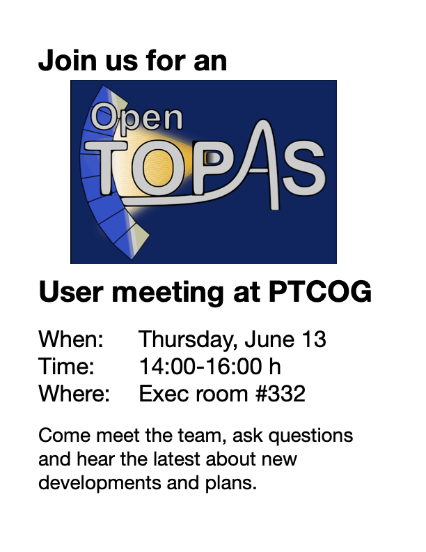

.. TOPAS-nBio documentation master file, created by
   sphinx-quickstart on Thu Apr 12 01:24:56 2018.
   You can adapt this file completely to your liking, but it should at least
   contain the root `toctree` directive.

OpenTOPAS user meeting at PTCOG
===============================
Are you attending PTCOG? Then come join us for an OpenTOPAS user meeting.

TOPAS-nBio v3.0 released
===============================
The new TOPAS-nBio v3.0 has been released and is based on OpenTOPAS v4.0.
Please see the release notes for (some of) the new features that are available:
https://github.com/topas-nbio/TOPAS-nBio/releases/tag/latest

The release comes with a new forum, please use the discussions on the TOPAS-nBio GitHub for an integrated experience.

New TOPAS-nBio forum
===============================
Please use the Discussions option in the TOPAS-nBio GitHub for any new threads of the forum, go to:
https://github.com/topas-nbio/TOPAS-nBio/discussions

OpenTOPAS version v4.0 released
===============================

This is an important announcement for our users on the release of OpenTOPAS. 

The TOPAS team has moved to a full open-source approach with major upgrades. This new version of OpenTOPAS is a continuation of the TOPAS development. The past principal investigators, Drs. Harald Paganetti and Bruce Faddegon, and the new principal investigators, Drs. José Ramos and Jan Schuemann are committed to continuing TOPAS's development and long-term sustainment through OpenTOPAS.

1. Version 4,0 of OpenTOPAS is available through a new GitHub at https://opentopas.github.io/index.html. Version numbers continue in sequence from previous versions of TOPAS.

2. Major improvements include:
    - Update to Geant4.11.1.3 -  rigorous testing completed
    - A wholly new, doubly diverging MLC to replace the past defective one
    - A new second cancer model
    - A new mesh phantom model for mice
    - The first imaging extension to allow modeling of basic CT, SPECT, and PET imaging detectors (to be expanded)
    - A new module for photo-neutron simulation in X-ray therapy
    - Support for all optical material properties provided by Geant4

3. For the TOPAS-nBio extension, all new releases of TOPAS-nBio will be tested exclusively for compatibility with OpenTOPAS. A new OpenTOPAS-nBio release is planned for the end of May.

4. A new user guide with improved search capabilities and all new features will soon be available at the OpenTOPAS GitHub and  https://opentopas.readthedocs.io/en/latest/.

5. A quick start procedure for installing OpenTOPAS may be found on GitHub (OpenTOPAS_quickstart_Debian.md or OpenTOPAS_quickstart_forMacOS.md)

6. Our development team will address all questions on OpenTOPAS through the OpenTOPAS user forum, which can be accessed through GitHub at https://github.com/OpenTOPAS/OpenTOPAS/discussions. 

7. Various other improvements are listed on our GitHub website. 
We are already working on the next release, which will include Geant4 version 11.2, a new interface compatible with DICOM-RT for x-ray and electron therapy, and a new example for multi-scale SARRP simulations.

8. The OpenTOPAS team is working on long-term sustainment plans with the help of NIH/NCI. 
 

We can't wait to see our users advancing medical uses of ionizing radiation with OpenTOPAS. Please take advantage of the OpenTOPAS user forum and its refined capabilities.
 

We look forward to seeing you there.

José Ramos, Jan Schuemann, Harald Paganetti, Bruce Faddegon, and the entire OpenTOPAS team

 

Welcome to the documentation of TOPAS-nBio!
=========================================================================================

The TOPAS Monte Carlo (MC) system has played a significant role in making Monte Carlo simulations widely available for proton therapy related research and is further used in radiation therapy and medical imaging research. While TOPAS provides detailed simulations of patient scale properties, the fundamental unit of the biological response to radiation is a cell. Thus, we developed TOPAS-nBio, an extension of TOPAS dedicated to advance understanding of radiobiological effects at the (sub-)cellular (i.e., the cellular and sub-cellular) scale. TOPAS-nBio is designed as a set of open source classes that extends TOPAS to model radiobiological experiments. TOPAS-nBio is based on and extends Geant4-DNA, which extends the Geant4 toolkit, the basis of TOPAS, to include very low-energy interactions of particles down to vibrational energies. TOPAS-nBio explicitly simulates every particle interaction (i.e., without using condensed histories) and propagates radiolysis products. To further facilitate the use of TOPAS-nBio, a graphical user interface was developed. TOPAS-nBio offers full track-structure Monte Carlo simulations, integration of chemical reactions within the first millisecond, an extensive catalogue of specialized cell geometries as well as sub-cellular structures such as DNA and mitochondria. TOPAS-nBio provides the initially induced damage patterns and interfaces to mechanistic models of DNA repair kinetics. Thus, together with TOPAS, this extension offers access to accurate and detailed multiscale simulations, from a macroscopic description of the radiation field to microscopic description of biological outcome.

The TOPAS-nBio package was described in Radiation Research, 2019, 191(2), p.125 (also see :ref:`Citations`).
By releasing TOPAS-nBio as an open source extension to TOPAS, we intend to encourage active involvement of the research community to continuously extend and improve the features of TOPAS-nBio. 

.. toctree::
    :maxdepth: 1
    :caption: Getting Started

    getting-started/Introduction
    getting-started/HowToInstall
    getting-started/ParameterFile
    getting-started/Members
    getting-started/Citations
    getting-started/License
   
    
.. toctree::
    :maxdepth: 1
    :caption: Geometries

    Geometries/Intro
    Geometries/Cells
    Geometries/CellsWithNanoparticles
    Geometries/DNAmodels
    Geometries/Nucleus
    Geometries/Other	
    

.. toctree::
    :maxdepth: 1
    :caption: Processes
 
    Processes/Intro		
    Processes/Physics
    Processes/Chemistry

.. toctree::
    :maxdepth: 1
    :caption: Biological Modeling
	
    Modeling/Intro
    Modeling/DNARepair

.. toctree::
    :maxdepth: 1
    :caption: GUI
	
    GUI/Intro	

.. toctree::
    :maxdepth: 1
    :caption: Scorers

    Scorers/Intro
    Scorers/Cells
    Scorers/DNAScorers
    Scorers/Chem
    
  
